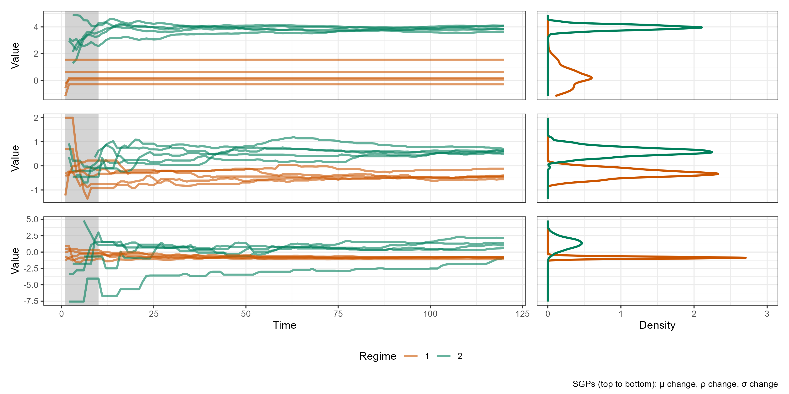

# Introduction

## Motivation

Interesting class of non-linear time series models -- regime switching (RS) models:

- Allows for different behaviors (parameters) across different regimes.
- Widely used in economics and finance, e.g., business cycles, market volatility.
- Big diversity: Markov-switching, threshold models, smooth transition, etc.

It is important to understand the _factors that influence their performance_, and give _practical recommendations_ to econometricians.


## Motivation

_Two focuses_ in this work. _The first_ is more common in forecasting econometrics:

- Exactly identifying the DGP is the exception, not the rule, we're looking for good approximators.
- Thus, I analyze the sensitivity of each RS model to different mis-specifications.
- Stylized results on how these models operate and interact with different DGPs.
- Practical results on which models are more robust, which elements of the DGP are more important to identify.


## Motivation

_Two focuses_ in this work. _The second_ is less orthodox and specific to RS models:

- RS models estimate both the series and its regimes.
- This allows for characterizing the regimes, and how different they are from each other.
- This characterization might be informative for the model's performance.
    - E.g.: conditional average of the estimated regimes, for a DGP with different intercepts.
- Understand which characteristics are important in which contexts.


## General Methodology and Goals

```{=tex}
\stepcounter{subsection}
```

The nature of this project is explorative.

I will simulate a diverse set of DGPs and try to find stylized facts about:

- How each RS model adjusts to them.
- How the characteristics of the estimated regimes relate to this adjustment.


## General Methodology and Goals

Common setup: establish a theoretical framework that describes all RS models in a unified way.

- Separate the DGP into regime generating process (RGP) and series generating process (SGP).
- Define a diverse menu of DGPs by varying these 'ingredients'.
    - Cyclically updated based on the results of the exploratory analysis.
- Monte Carlo simulations to generate series, each applied to all considered models.

A partial goal is to create a very general and expandable theoretical framework, simulation structure, and code implementation.


## General Methodology and Goals

For the first goal, I:

- Study the generated series
    - How each DGP 'works' and how RGP and SGP interact.
- Study the estimation of the models.
    - Their fit, distribution of estimatives, and how these change across DGPs.
- Then, sistematize the correlations with regression analysis.
    - $\text{RMSE} \sim \sgp \cdot \rgp \cdot \mod$.


## General Methodology and Goals

For the second goal, I:

- Define the menu of regimes' characteristics that can be relevant in each DGP.
    - E.g. the conditional average for DGPs with intercept changes.
    - Also cyclically updated.
- Calculate these metrics for the Monte Carlo results.
- Study their behavior across DGPs and models.
- Then, sistematize the correlations with regression analysis.
    - $\text{RMSE} \sim \sgp \cdot \rgp \cdot \mod \cdot \text{metric}$.


---

```{=tex}
\tableofcontents
```


---

**Current stage of the work:**

- The theoretical framework and simulation structure was the focus, and is mostly finished.
- The cycle of _menu_ $\to$ _exploratory analysis_ $\to$ _systematic analysis_ $\to$ _menu update_ is ongoing.
- The tools (graphs, tables, regressions) for the analysis have been created.
    - Some are presented here, for illustration.
    - Most information hasn't been processed yet.
- Thus, the motivation and paths to follow are still abstract.


# Theoretical Framework

## Theoretical Framework

Goal:

- Define the general structure of RS DGPs, in a unified mathematical representation.
    - An important idea is the separation of the DGP into RGP and SGP.
- Relate the concepts of models and metrics to it.
- Describe the specific options considered in the menu.
    - And the motivations behind them.
    - The hyperparametrization was not carefully chosen, yet.


## Definitions - DGPs

Let:

- $y_t \in \mathbb{R}$ denote the series of interest
    - At time $t \in 1:T$[^colon], $T \in \mathbb{N}$.
- $S \in \mathbb{N}$ denote the number of regimes.
- The _regime variable_ is a vector of 'weights' for each regime, indexed by $r^s_t$, $s \in 1:S$.

[^colon]: Let $a:b \coloneqq \{a, a+1, \dots, b\}$ for $a \leq b \in \mathbb{Z}$, and $y_{a:b} \coloneqq \{y_a, \dots, y_b\}$.


## Definitions - DGPs

A DGP can be written in terms of a pair: _regime generating process_ (RGP) and _series generating process_ (SGP). These are functions with parameters $\Theta_r$ and $\Theta_y$, respectively, such that:

\begin{equation}
\begin{array}{rrlllll}
    r_t &= \rgp(&y_{1:(t-1)}, &r_{t-1}, &t &;~ \Theta_r &)\\
    y_t &= \sgp(&y_{1:(t-1)}, &r_t,     &t &;~ \Theta_y &)\\
        &= \sgp(&y_{1:(t-1)}, &\rgp(y_{1:(t-1)}, r_{t-1}, t; \Theta_r), &t &;~ \Theta_y &)
\end{array}
\end{equation}

Notably, the number of regimes $S$ is a parameter in $\Theta_r$.


## Definitions - DGPs

$\Theta_y$ is actually a set of different parameters for each regime, each indexed by $\Theta^s_y$. This means that the SGP can be written as:

\begin{equation}
    \sgp(y_{1:(t-1)}, r_t, t;~ \Theta_y) = \sum_{s = 1}^S f_{\sgp}(y_{1:(t-1)}, t;~ \Theta^s_y) \cdot r^s_t
\end{equation}

Each regime is weighted by the regime variable $r^s_t$. In the simplest case, this weight is binary (on vs. off).

I refer to $f_{\sgp}$ as the _SGP functional form_[^funforms], or simply _SGP_, and the set of parameters $\Theta_y$ as the _regime nature_.

[^funforms]: $\Theta_y$ could encode different functional forms for each regime.


## Definitions - DGPs

\begin{figure}[H]
    \centering
    \caption{The general RS DGP structure.}

    \begin{tikzpicture}[font=\sffamily]
    % Styles:
    \tikzset{mybrace/.style={decorate, decoration={brace, amplitude=10pt, raise=1.3ex}}}
    \tikzset{node distance = 0.25cm and 0.1cm}

    % Main nodes:
    \node[] (dgp) {DGP};
    \node[] (e)   [right = 0.8cm of dgp] {$=$};
    \node[] (sgp) [right = 0.8cm of e] {SGP};
    \node[] (p)   [right = 1.4cm of sgp] {\&};
    \node[] (rgp) [right = 1.4cm of p] {RGP};

    % Lower nodes:
    \node[] (p2)   [below = 0.5cm of sgp] {\&};
    \node[] (csgp) [left  = of p2] {functional form};
    \node[] (rsch) [right = of p2] {regime nature};

    % Math:
    \node[] (msgp)  [above = of sgp] {$\sum_{s = 1}^S f_{\sgp}(. ~;~ \Theta_y^s) \cdot r_t^s$};
    \node[] (mrgp)  [above = of rgp] {$r_t = \rgp(. ~;~ \Theta_r)$};
    \node[] (mcsgp) [below = 0.35cm of csgp] {$f_{\sgp}$};
    \node[] (mrsch) [below = of rsch] {$\{\Theta^1_y, \dots, \Theta^s_y\}$};

    % Braces using the defined style, add mirror in place:
    \draw[mybrace]         (csgp.west) -- (rsch.east);
    \draw[mybrace, decoration={mirror}] (mrgp.west) -- (mrgp.east);
    \draw[mybrace, decoration={mirror}] (msgp.west) -- (msgp.east);
    \draw[mybrace, decoration={amplitude=8pt}]         (mcsgp.west) -- (mcsgp.east);
    \draw[mybrace]         (mrsch.west) -- (mrsch.east);
    \end{tikzpicture}
\end{figure}

To construct a diverse set of DGPs, I combine different RGPs, SGPs, and regime natures. Challenge: do so in a comprehensive yet systematic way.


## Definitions - DGPs

I omitted the error term. For our purposes, consider the DGP as a function that receives a vector of random erros[^erros]:

\begin{equation}
    (y_{1:T},~ r_{1:T}) = \dgp(\varepsilon_{1:T};~ \Theta_r, \Theta_y)
\end{equation}

[^erros]: This is a simplification, assuming the same error distribution across regimes.

Let the menu of DGPs be $P$ (for 'processes').


## Definitions - Models

Consider a model $\mod$ as a function:

- With parameters $\Theta_m$.
- That generates the fitted values and $h$-step ahead predictions.
- Of the series and regimes (and maybe some metadata).

\begin{equation}
    (\hat{y},~ \hat{r}) = \mod(y_{1:(T-h)} ~;~ \Theta_m)
\end{equation}

Notably, the number of estimated regimes $\hat{S}$ is a parameter in $\Theta_m$, which differ from $S$.

Let the set of models be $M$ (for 'models').


## Definitions - Metrics

A conditional metric $c$ is a function that:

- Receive a vector of series and a vector of regimes.
- Are calculated separately for the set $R_s$ of observations pertaining to each regime.
    - Non-stationarity imposes some limitations here.
    - Continuous regime variables can be transformed into binary ones.

\begin{equation}
\begin{array}{l}
    c: (y, r) \mapsto (R_s)_{s = 1}^S \mapsto \mathbb{R}^{S} \\
    R_s \coloneqq \left\{ y_t ~:~ r^s_t = \max\{r_t\} \right\}
\end{array}
\end{equation}

Let the set of metrics be $C$ (for 'criteria').


## Definitions - Metrics

Metrics can be calculated in different ways:

- Metrics of the true values conditional on the true regimes: $c(y, r)$.
- Similarly for the estimated values: $c(\hat{y}, \hat{r})$.
- The difference between the two might be important.

The absolute value of a metric might be less important than its dispersion across regimes.

- I.e., how different are the regimes in terms of that characteristic.

Some of this information are available to the econometrician, some are not.


## Menu - SGP functional forms

```{=tex}
\stepcounter{subsection}
```

The SGP is important in its interaction with the RGP, and is context-specific (i.e. GARCH models).

For now, a simple $AR(1)$ is considered, for its wide use and ease of estimation.

To simplify the metrics' analysis, I will focus on stationary models, thus $|\rho_1| < 1$.

**Stationary AR(1):**

\begin{equation}
\begin{array}{ll}
    &y_t(. ~;~ (\mu, \rho_1, \sigma)) = \mu + \rho_1 y_{t-1} + \sigma \cdot \varepsilon_t, ~~ \varepsilon_t \sim \mathcal{N}(0, 1)\\
    &|\rho_1| < 1, ~~ \sigma > 0
\end{array} \tag{SGP-AR(1)}
\end{equation}


## Menu - RGPs

To start, I will consider only two regimes, and some of the most common RGPs: Structural Break, Self-Exciting Threshold, Smooth-Transition, and Markov-Switching.

**Structural Break (SB):** Regime changes at specific time points $\tau \in (1:T)^{S-1}$.

\begin{equation}
\begin{array}{ll}
    &r^s_t(. ~;~ \tau) = \mathbb{1}(\tau'_{s-1} < t \leq \tau'_s), ~~ \forall s \in \{1, \dots S\}\\
    &\tau \in \mathbb{N}^{S-1}, ~~ \tau_{s} > \tau_{s-1} ~\forall s, ~~ \tau' = (0, \tau, T)\\
\end{array}\tag{RGP-SB}
\end{equation}

**Considered parametrizations:** "Break at 1/2" and "Break at 2/3".


## Menu - RGPs

**Self-Exciting Threshold (SET):** Regime changes when the lagged/transformed[^g_abs] series $g(y_{t-d})$ crosses some threshold values $\tau \in \mathbb{R}^{S-1}$.

[^g_abs]: For example, $g(x) = |x|$ or $g(x) = \Delta x$.

\begin{equation}
\begin{array}{ll}
    &r^s_t(. ~;~ (\tau, d, g)) = \mathbb{1}(\tau'_{s-1} < g(y)_{t-d} \leq \tau'_s), ~~ \forall s \in \{1, \dots S\}\\
    &\tau \in \mathbb{R}^{S-1}, ~~ \tau_{s} > \tau_{s-1} ~\forall s, ~~ \tau' = (-\infty, \tau, \infty), ~~ d \in \mathbb{N}^*
\end{array}\tag{RGP-SET}
\end{equation}

**Considered parametrizations:** "Threshold at 0" and "Threshold at 0.5".


## Menu - RGPs

**Smooth Transition (ST):** Regime changes smoothly, with a CDF-like function $g$ applied on the difference between the series and the threshold $\tau \in \mathbb{R}$. A generalization to $S$ regimes is equivalent to a neural network [@Medeiros2000]. Parameters of $g$ can be estimated.

\begin{equation}
\begin{array}{ll}
    &r^1_t(. ~;~ (\tau, d, g)) = g(y_{t - d} - \tau),\\
    &r^2_t(. ~;~ (\tau, d, g)) = 1 - r^1_t(. ~;~ (\tau, d, g))\\
    &\tau \in \mathbb{R}, ~~ d \in \mathbb{N}^*
\end{array}\tag{RGP-ST}
\end{equation}

**Considered parametrizations:** "LSTAR at 0" and "LSTAR at 0.5".


## Menu - RGPs

**Markov-Switching (MS):** Regime changes stochastically, following a Markov process with transition matrix $\Gamma \in [0, 1]^{S \times S}$.

\begin{equation}
\begin{array}{ll}
    &r^s_t(. ~;~ \Gamma) \sim P(r^s_t = 1 | r_{t-1}) \eqqcolon \Gamma_{s, r_{t-1}}\\
    &\Gamma \in [0, 1]^{S \times S}, ~~ \sum_{i=1}^S \Gamma_{s, i} = 1 ~\forall s\\
\end{array}\tag{RGP-MS}
\end{equation}

**Considered parametrizations:** "Symmetric, High Persistence" and "Markov Symmetric, Low Persistence".


## Menu - Models

All the RGPs above have model counterparts, and I will use all of them. Additionally, more complex models such as random forest, neural networks, or clustering-based models could be considered.

Common aspects of the hyperparameterization:

- The number of regimes is fixed, and varied across options.
- All the coefficients are assumed to change across regimes.

## Menu - Models

**Structural Break AR:** Given $\tau$, the model estimates $\mu$ and $\rho_1$ via OLS in each regime. $\tau$ is chosen by minimizing the SSR over a grid search of breakpoints.

**Considered parametrizations:** No hyperparameterization needed.

**Seminal literature:** [@Chow1960], [@BaiPerron1998].


## Menu - Models

**Self-Exciting Threshold AR:** Given $\tau$ and $d$, the model estimates $\mu$ and $\rho_1$ via OLS in each regime. $\tau$ and $d$ are chosen by minimizing the SSR over a grid search of breakpoints and lags.

**Considered parametrizations:** The same transformation function $g$ as in the RGP will be considered. $d$ will be fixed at 1.

**Seminal literature:** [@TongLim1980].


## Menu - Models

**Smooth Transition AR:** Estimated via non-linear squares of the residuals, over $\mu$, $\rho_1$ (for each regime), $\tau$, and $\gamma$. Uses some numerical optimization.

**Considered parametrizations:** The same transformation function $g$ as in the RGP will be considered. Gamma will be fixed.

**Seminal literature:** [@Terasvirta1994].


## Menu - Models

**Markov-Switching AR:** The MS-AR DGP is a state-space model, which can then be related to filtering and smoothing techniques. The EM algorithm uses Kalman to find smoothed probabilities of $r$, which is used to update the current guess of parameters via maximizing the likelihood (given the probabilities). These two steps are iterated until convergence.

**Considered parametrizations:** No hyperparameterization needed.

**Seminal literature:** [@Hamilton1989].


## Menu - Regime natures

The options are given below, in the format (_parameter in regime 1_, _parameter in regime 2_):

- **Mean ($\mu$) change:**
    - Small difference: ($\mu = 0$, $\mu = 0.5$)
    - Large difference: ($\mu = 0$, $\mu = 2$)
- **Persistence ($\rho_1$) change:**
    - Small difference: ($\rho_1 = 0.6$, $\rho_1 = 0.4$)
    - Large difference: ($\rho_1 = 0.9$, $\rho_1 = 0.1$)
- **Volatility ($\sigma$) change:**
    - Small difference: ($\sigma = 1$, $\sigma = 2$)
    - Large difference: ($\sigma = 1$, $\sigma = 4$)

Other options: sign switching, new lag introduction, etc.

Note that the regimes are always ordered increasingly by the parameter of interest.


## Menu - Metrics

Each change specified by the regime natures is expected to affect the series in a different way, and thus, be captured by different metrics.

First metric guess: the parameter of interest. In cases where more than one parameter changes, this becomes less useful. I will consider other metrics more 'agnostic' over the DGP.

For the _dispersion_ of a metric, I consider the standard deviation and average pairwise distance.


## Menu - Metrics

Mean ($\mu$) change:

- $\widehat{\mu^s}$ and the _conditional average_.
- For the dispersion, direct measures of distance such as the _silhouette score_.

Persistence ($\rho_1$) change:

- $\widehat{\rho_1^s}$ and the _conditional autocorrelation_ of lag 1.

Volatility ($\sigma$) change:

- $\widehat{\sigma^s}$.


## Menu - Metrics

Performance metrics:

- $R^2$ for fit performance.
- RMSE and MAPE for forecasting performance.

RGP metrics:

- Average duration of a regime.
- Empirical transition matrix.
- Midpoint between regimes.


# Monte Carlo Simulations

## Simulation Structure

There are the following steps to perform the simulations:

1. Generate random errors for all the DGPs.
2. For each DGP and simulation, generate ($y, r$).
3. For each DGP, simulation, and model, obtain $(\hat{y},~ \hat{r})$.
4. For each DGP, simulation, and model, compute each metric.
5. Aggregate the metrics, performance information, and DGP and model descriptors into a dataset.

This modular approach was chosen to fit in the exploratory nature of the work.

The implementation is done in R, and is available in [github.com/ricardo-semiao/article-regime-id-performance](https://github.com/ricardo-semiao/article-regime-id-performance). The code is modular, reproducible, and expandable.


## Simulation Structure

For the forecast performance, I focus on $1$-step ahead predictions. Local projections could be considered.

To increase the number of forecast points per simulation, i predict $10$ $1$-step ahead predictions, $\hat{y}_{T-h} \mid y_{1:(T - h - 1)}$.

The current parameters of the simulation are as follows:

- Number of simulations: $I = 500$.
- Total number of observations: $T = 120$.
- Burn-in period: $10$.
- Forecast horizon: $10$ predictions of $1$-step ahead values.

Let $i \in 1:I$, $I \in \mathbb{N}$ be the simulation index.


## Simulating Errors

The set of DGPs $P$ is the cartesian product of the considered RGPs, SGPs, and regime natures.

I create $|P| \cdot I$ sets of random error vectors, each of size $1:T$. They are generated in parallel, using [TRNG](https://www.numbercrunch.de/trng/). Let $\Epsilon$ denote the set of all errors.

Let $\Epsilon_{p, i}$ denote the vector of errors generated for the $p$-th DGP and the $i$-th simulation.

Error diagnostics are presented in the appendix.


## Simulating Series

Let $Y$ and $R$ denote the sets of generated series and regime variables for each $p$ and $i$. They are computed given $\Epsilon_{p, i}$:

\begin{algorithm}[H]
\begin{algorithmic}[1]
    \State Initialize $Y$ and $R$
    \For{$(p, i)$ \textbf{in} $(1:|P|) \times (1:I)$}
        \State Spawn a new parallel task
        \State $Y_{p, i},~ R_{p, i} \gets P_p(\Epsilon_{p, i})$
\EndFor
\end{algorithmic}
\end{algorithm}

The nesting order here and in the next sections were chosen to optimize the parallelization.


## Estimating Models

For each simulation, I estimate each model, generating the sets $\hat{Y}$ and $\hat{R}$. The models are trained using only $y_{(10 + 1):(T-10)}$. They are computed given $Y_{p, i}$ and $R_{p, i}$:

\begin{algorithm}[H]
\begin{algorithmic}[1]
    \State Initialize $\hat{Y}$ and $\hat{R}$
    \For{$(p, i)$ \textbf{in} $(1:|P|) \times (1:I)$}
        \State Spawn a new parallel task
        \For{$m$ \textbf{in} $1:|M|$}
            \State $\hat{Y}_{p, i, m},~ \hat{R}_{p, i, m} \gets M_m(Y_{p, i})$
        \EndFor
    \EndFor
\end{algorithmic}
\end{algorithm}


## Estimating Metrics

Then, for each model, the metrics and other meta-information are calculated and stored as columns of a dataset $D$. Each line of $D$ is an observation $(p, i, m)$, each column a metric $(c)$.

\begin{algorithm}[H]
\begin{algorithmic}[1]
    \State Initialize $D$
    \For{$(p, i, m)$ \textbf{in} $(1:|P|) \times (1:I) \times (1:|M|)$}
        \State Spawn a new parallel task
        \For{$c$ \textbf{in} $1:|C|$}
            \State $D_{(p, i, m),~ c} \gets C_c(\hat{Y}_{p, i, m})$
        \EndFor
        \State $D \gets$ performance metrics and DGP/model categorical descriptors
    \EndFor
\end{algorithmic}
\end{algorithm}


## Simulation Dimensions

- There are $48$ DGPs considered.
    - $1$ SGP, $6$ regime natures, and $8$ options of RGP.
- Each is simulated $500$ times, yielding $24,000$ series.
- For each simulation, $4$ models are estimated, yielding $96,000$.
    - $946$ had convergence problems and were removed, leaving $95,054$ estimated models.
    - The total of estimated time points is $11,407,680$.
    - The biggest bottleneck, but with this numbers takes about 2 hours to run.
- There are $17$ metrics, $2$ regimes, and $3,231,836$ metrics calculated.
    - $2$ performance metrics. Also $3$ SGP metrics, $0$ RGP metrics, and $2$ parameters.
    - Calculated with the true, estimated values, and their difference.
- $4,154$ -- the current number of lines of R code in the repository.


# Exploratory Analysis

---

Recalling the **current stage of the work:**

- The tools (graphs, tables, regressions) for the analysis have been created.
    - Some are presented here, for illustration.
    - Most information hasn't been processed yet.
- My goal today is to present these tools and the type of analysis I intend to do.


## Exploratory Analysis

Goals:

- Explore the data.
- Learn how each DGP behaves, and how the models interact with them.
- Motivate the modeling decisions for the systematic analysis.

Obs: the regimes are ordered increasingly by the parameter that changes. This is only possible in the single-parameter change regime natures.


## Series - Values

@fig-sim-v1 show the series' values and distribution, for the MS-AR(1) model, with a symmetric high-persistence transition matrix.

Each row represents a different regime nature, with only $\mu$ changing, only $\rho_1$ changing, and only $\sigma$ changing, respectively. The grey area is the burn-in period.

We can see how:

- The high persistence of regimes is indeed present.
- The change in intercept and volatility are clear.
- The higher $\rho_1$ conditions a more volatile regime


## Series - Values

{#fig-sim-v1}


## Series - Values

@fig-sim-v2 shows the series for the SET-AR(1) model, with a threshold at 0.

The interaction between RGP and the regime nature is evident:

- The higher $\mu$ makes the series likely to stay in regime 2.
- The higher volatility and $\rho_1$ when above $0$ conditions a higher level for the series in the second regime.

Many other observations could be made.


## Series - Values

{#fig-sim-v2}


## Series - Metrics

Here, I check:

- How the metrics behave in the simulated series.
    - Useful to rethink which metrics are relevant for each regime nature.
- How the metrics converge across $T$.
    - If our chosen $T$ were too small, even metrics that well characterize the regimes would not do so.
    - To analyze convergence, I plot the metrics calculated up to time $t$, for all $t \in 1:T$.
    - Lines for multiple simulations can be combined to analyze convergence across $I$.


## Series - Metrics

@fig-sim-m1 shows the metrics for the SET-AR(1) model, with a threshold at 0.

Each row represents a different regime nature, thus a different conditional metric (mean, ACF(1), and SD, respectively).

In general, the metrics seem to converge and to characterize the regimes.


## Series - Metrics

{#fig-sim-m1}


## Series - Metrics

@fig-sim-m2 shows a metric for the RGP itself, for the MS-AR(1). Specifically, the empirical (non-)transition probability for each regime.

We can see how the metrics converge to the true value ($0.8$), across all regime natures.


## Series - Metrics

{#fig-sim-m2}


## Series - Metrics

In a more systematic way, I:

- Tabulate the average and standard deviation of the metrics, across DGPs.
- Test the null hypothesis that the metrics do not vary across regimes (ANOVA).
    - Note that the power of this test is directly related to the number $I$ of simulations.


## Series - Metrics

```{=tex}
\input{../../outputs/simulations/table_sgps.tex}
```


## Models

```{=tex}
\stepcounter{subsection}
```

Now, similar analisis can be done, which enables us to understand how the models interact with the DGPs.

- Instead of comparing the true and estimated series' values, I plot the residuals.
    - Besides separating them by regimes, I also separate them by $\mathbb{1}(\hat{r}_t = r_t)$.
- The same metrics can be calculated for the estimated counterparts.
    - I analyze if the models capture the regimes' characteristics, across mis-specifications.
- Additionally, check the coefficients' distributions vs. true values.
    - Useful to note how coefficients that _shouldn't_ change compensate mis-specifications.


## Models - Values

@fig-mod-v1 shows the residuals and their distribution for the MS-AR(1) model, estimated on top of an SB RGP. @fig-mod-v2 color the regimes by 'correctness'.

It appears that the estimated regime relates more to the residual level than its actual correctness.

The differences in average and volatility are expected, and no difference can be seen in the autocorrelation change.

Again, in a more systematic way, I tabulate the average and standard deviation of the residuals across estimated regimes.


## Models - Values

{#fig-mod-v1}


## Models - Values

{#fig-mod-v2}


## Models - Values

```{=tex}
\input{../../outputs/estimations/table_residuals.tex}
```


## Models - Coefficients

Here, I analyze if the models capture the coefficients and their difference across regimes.

Note that this might not be a necessary condition for a good approximation.

@fig-mod-c1 follows the same model from before and shows:

- The distribution of each estimated coefficient ($\mu$ and $\rho_1$)
- While the dotted lines give the true values.


## Models - Coefficients

{#fig-mod-c1}


## Models - Metrics

Now, the same graphs and tables can be created for the estimated values.

At the end, a table comparing the true and estimated metrics shows which (model, DGP) pairs are unable to capture which characteristics of the regimes.


# Systematic Analysis

## Systematic Analysis

Using the stylized facts learned in the exploratory analysis, I do regression analysis to understand the relationship between performance and:

- DGP elements.
    - Which SGPs, RGPs, and regime natures are more difficult to model?
- Models, and specially their interactions with DGPs.
    - Are there models generally more robust to mis-specifications?
    - Which models suffer more from which mis-specifications?
    - What are the role of regime and coefficient identification in this?
- Regime characteristics.
    - Do the metrics calculated relate to performance? In which contexts?
    - How does this relate to coefficient and regime _timings_ identification?
- Other exercises.


## DGP elements

An important placebo test is to check if the simulation index $i$ has no effect:

\begin{equation}
    rmse_{p, i, m} = \beta_0 + \beta_1 i + \varepsilon_{p, i, m}
\end{equation}

The estimated $\beta_1$ is $5.0e-5$, with a p-value of $0.051$. Given the high power of the test, this seems to be a negligible effect.


## Stylized Facts about DGP elements

Consider the categorical variables $\rgp_{p, i}$ (i.e., vector of dummies), that indicates which RGP was used, and similar definitions for $\sgp_{p, i}$ and $\mod_{p, i}$.

\begin{equation}
    rmse_{p, i, m} = \beta_0 + \beta_1 \rgp_{p, i} + \beta_2 \sgp_{p, i} + \beta_3 \rgp_{p, i} \cdot \sgp_{p, i} + \varepsilon_{p, i, m}
\end{equation}

Compared to the omitted group of $\mu$ change and Markov RGP, only the volatility change has higher RMSE.

All the interactions, except volatility with threshold, have positive coefficients.


## Stylized facts about models

Then, I analyze the fixed effects of the models. To capture their sensitivity to mis-specification, we can add interactions between it and the DGP.

An indicator of correct specification, but this loses information about the type of mis-specification:

\begin{multline}
    rmse_{p, i, m} = \beta_0 + \beta_1 \rgp_{p, i, m} + \beta_2 \sgp_{p, i} + \beta_3 \rgp_{p, i} \cdot \sgp_{p, i} + \beta_4 \mod_{p, i, m}\\ + \beta_5 \mathbb{1}(\mod_{p, i, m} = \rgp_{p, i}) + \varepsilon_{p, i, m}
\end{multline}


## Stylized facts about models

Then, I analyze the fixed effects of the models. To capture their sensitivity to mis-specification, we can add interactions between it and the DGP.

Or, a full interaction between model and RGP:

\begin{multline}
    rmse_{p, i, m} = \beta_0 + \beta_1 \rgp_{p, i, m} + \beta_2 \sgp_{p, i} + \beta_3 \rgp_{p, i} \cdot \sgp_{p, i} + \beta_4 \mod_{p, i, m}\\ + \beta_5 \mod_{p, i, m} \cdot \rgp_{p, i} + \varepsilon_{p, i, m}
\end{multline}

One of the most significant results was a particularly bad interaction between a smooth transition model estimating a structural break RGP.


## Coefficients and performance

The regression above can be expanded to include the dispersion of the estimated coefficients across regimes.

This is a similar exercise as the next one, as the coefficients can also be seen as regime-conditional metrics themselves.


## Regimes characteristics and performance

To analyze this relation, I propose adding the metrics values as an additional regressor, and an interaction between it and the model.

As each metric is specific to each SGP, the regressions will be run separately for each regime nature.

\begin{multline}
    rmse_{p, i, m} = \beta_0 + \beta_1 \rgp_{p, i, m} + \beta_2 \sgp_{p, i} + \beta_3 \rgp_{p, i} \cdot \sgp_{p, i} + \beta_4 \mod_{p, i, m}\\ + \beta_5 \mod_{p, i, m} \cdot \rgp_{p, i} + \beta_6 c_{p, i, m} + \varepsilon_{p, i, m}
\end{multline}

In general, the true vs. estimated difference of the conditional metric's dispersion has a positive relation with RMSE.

On the other hand, the absolute dispersions also seem to have a positive relation with RMSE, which is counter-intuitive.


## Other exercises

- In the simple setup where ordering regimes is possible, the regressions can be run at the $(p, i, m, s)$ level. The results would indicate within each regime a model performs better.

- Simiarlly, the metrics can be calculated for the true, estimated values, and the difference.

- Results on whether the metrics indeed characterize the regimes, and if the models are able to capture that. These could be formalized via regressions too.


## Other exercises

- The identification performance of the regime variable can be treated as a dependent variable, or also as a control.

- Te sensitivity to mis-specification of the number of regimes, can be studied via interactions between $\mathbb{1}(\hat{S} < S)$ and metrics' dispersion. if the dispersion across regimes is low, mis-specifying the number of regimes should not be as harmful.

- If there is time, test if the practical recommendations help in a real-world example, and if the patterns are observed in real data.


# Conclusion

## Summary

:::{.incremental}
- Regime switching is an interesting way to model non-linearities in time series.
- Two focuses: sensibility to mis-specification, and take advantage of regime characteristics.
- Framework to generate a diverse menu of DGPs, models, and metrics.
    - Theoretical framework, simulation methodology, and code implementation.
    - Many interesting exercises left aside, but the setup is easily expandable.
- Big focus on exploratory analysis.
    - How DGP behaves, how models interact with them, and how metrics are relevant.
- Systematic analysis with potential for practical recommendations.
:::


---

```{=tex}
\begin{center}
\Huge Obrigado :)
\end{center}
```


## Referências

:::{#refs}
:::


# Appendix

## Error Diagnostics


## Error Diagnostics


