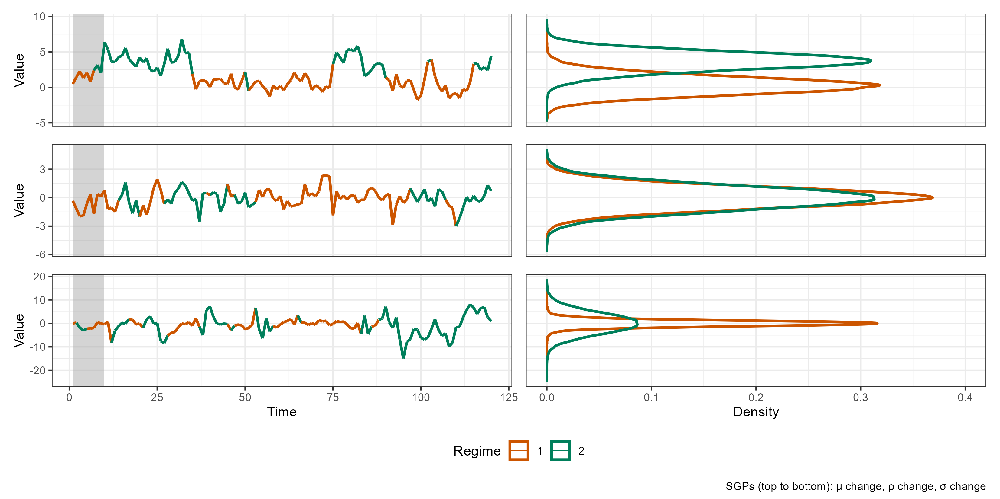
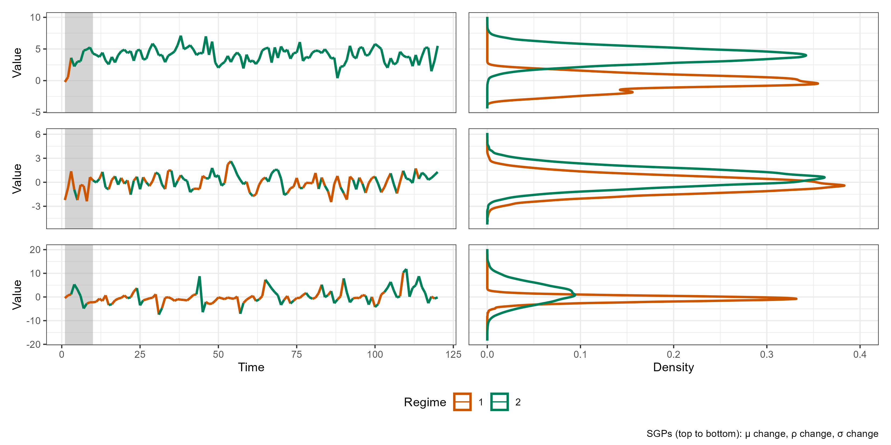
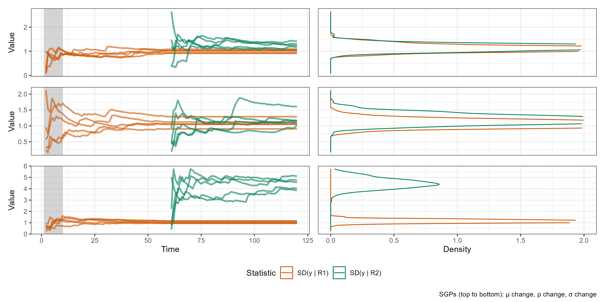
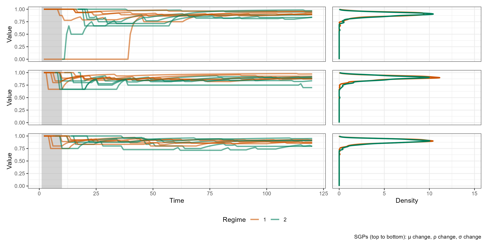
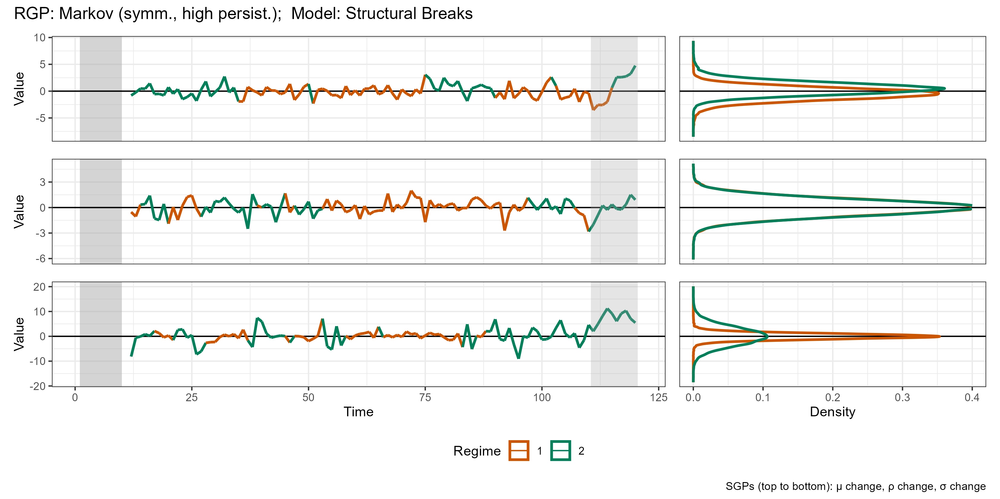
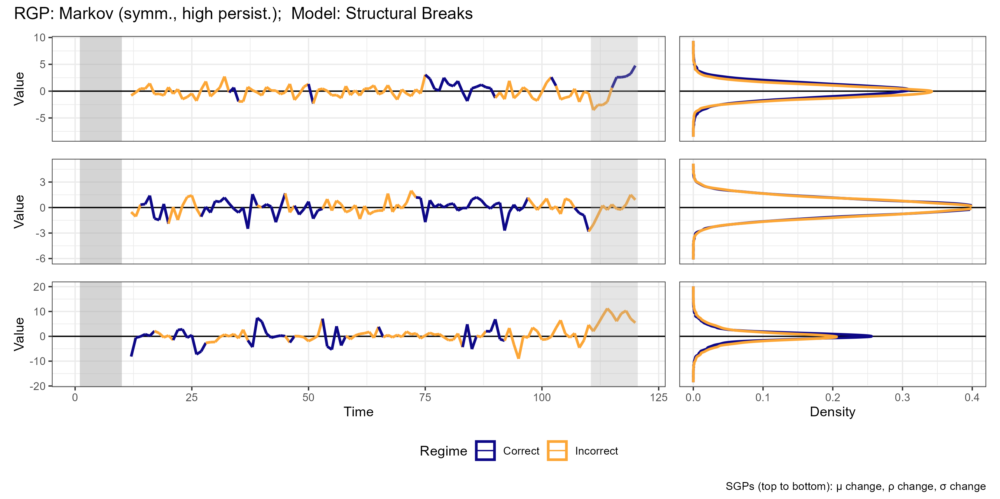
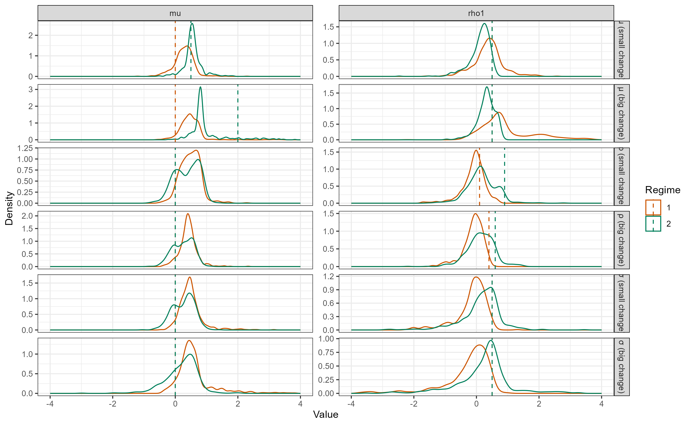
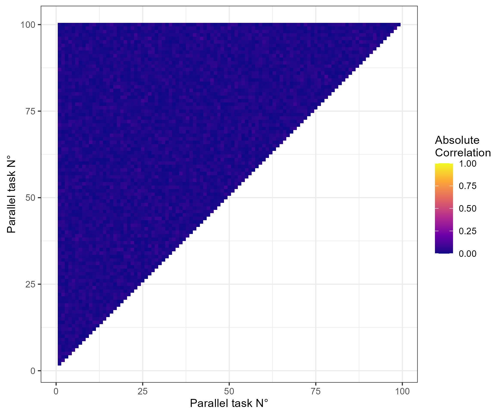
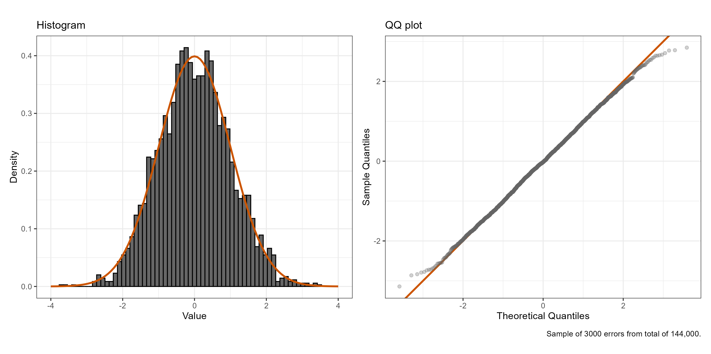

```{=tex}
\newcommand{\sgp}{\text{sgp}}
\newcommand{\rgp}{\text{rgp}}
\newcommand{\dgp}{\text{dgp}}
\renewcommand{\mod}{\text{mod}}

\renewenvironment{quote}
    {\list{}{\rightmargin\leftmargin}%
    \item\relax\color{red}}
    {\endlist}
```

> Segue o rascunho atualizado da tese.
>
> O ponto mais importante, em relação à versão passada, é que deixei mais claro os possíveis objetivos que penso para o trabalho. Reescrevi a introdução que estava realmente confusa. Explicitei que existem dois possíveis objetivos, o mais tradicional, de estudar a sensibilidade dos modelos à má-especificação, e o menos ortodoxo, a parte que não soube explicar antes, relacionado à informação das características (métricas) dos regimes. Preciso entender se tem algum valor nesse segundo objetivo ou não. Também falei um pouco sobre como montar um bom framework teórico e metodológico era um objetivo útil em si mesmo.
>
> Fiz um ou outro ajuste na metodologia seguindo seus conselhos, e simplifiquei a parte em que falava de métricas. Joguei fora algumas das opções de natureza de regimes, RGPs, e modelos, que acabei não incluindo na rodada de simulações iniciais (embora seria trivial incluir, a infraestrutura está pronta).
>
> Uma ou outra informação nova na seção de simulações. Falei dos parâmetros usados atualmente, simplifiquei a parte das métricas, e comentei sobre a dimensão final das simulações.
>
> A outra grande mudança foi a expansão dos "diagnósticos". Penso que explorar os DGPs e modelos é mais importante que mero diagnostico das simulações, e deve ter sua própria seção. Dei alguns exemplos de gráficos e tabelas descritivas que fiz.
>
> Deixei mais concreto quais comparações seriam feitas nos exercícios, definindo as especificações das regressões.
>
> No final, com a melhor explicação do objetivo, e agora com as ideias que tinha para a exploração das simulações colocadas de forma mais concreta, creio que é mais fácil de discutir quais exercícios são interessantes, e quais não fazem sentido nenhum e eu me sabotei ficando muito tempo pensando sozinhao :).


```{=tex}
\begingroup
\renewcommand\section{\oldsection}
\tableofcontents
\endgroup
```

# Introduction

Regime switching (RS) models describe time series that exhibit different behavior, different parameters, across different regimes. These models are useful to capture non-linearities in time series, and have been widely used in economics/finance, for instance, to model business cycles and market volatility. There are several types of regime switching modeling, some with stochastic switching, such as Markov-switching models, and some with deterministic switching, such as threshold models.

As with any forecasting model, it is important to understand the factors that influence their performance, and how econometricians can use this knowledge to improve their models. In this work, I focus on two aspects that could have received more attention in the literature: the sensitivity of these models to general mis-specifications, and the characteristics of the regimes they identify.

The first aspect is common in forecasting econometrics: exactly identifying the DGP is the exception, not the rule, so the modeling goal is actually to find a robust approximator. Because of this, it is important to understand how each RS model behaves under different mis-specifications, which yields insights into possible universal approximators and which elements of the DGP are most important to identify.

The second aspect is less orthodox and specific to RS models. These models are special in the sense that they not only identify the series in question but also its states -- its regimes -- thus allowing the econometrician to describe the characteristics of each regime and how different they are from each other. This characterization of regimes might be informative for the model's performance: for example, if the DGP implies different intercepts across regimes, a model whose identified regimes have the same conditional average is probably not capturing that dynamic well. That example might sound obvious, but understanding which characteristics are important in which contexts is not, and is the second aspect of this work.

<!-- Todo: change 'aspect' for a better word -->

The nature of this project is explorative. I will simulate a diverse set of DGPs and try to find stylized facts about (i) how each RS model adjusts to them, and (ii) how the characteristics of the estimated regimes relate to this adjustment. That may sound abstract, but in the remainder of this section I synthesize the methodology, describe the patterns I hope to find, and present some of the actual findings.


## Basic methodology and hypothesis

The methodology follows a common setup. The first step is to establish a theoretical framework that describes all RS models in a unified way. Here, I denote the separate 'ingredients' in an RS DGP: the _series generating process_ (SGP) and the _regime generating process_ (RGP). By varying these 'ingredients', I define a diverse set of DGPs to be considered—different contexts in which the models will be estimated. Then, Monte Carlo simulations are used to generate series, each being applied to all considered models. As many questions can arise from such an open motivation, creating a very general and expandable setup, with an implementation that reflects that, is a goal in itself.

For the first part of the work, processing the Monte Carlo results starts with visualizing the generated series, understanding how each DGP 'works' and how RGP and SGP interact. With this in hand, the fit of the models can be visualized, checking which models captured the dynamics in which contexts. Then, more systematic regression analysis is done, explaining the performance of each estimated model by the DGP and model used, as well as interactions between the two, which can capture measures of mis-specification.

The second part builds on the theoretical framework. I hypothesize which characteristics of regimes can be relevant for model performance in each context, e.g., the conditional average for DGPs with intercept changes. Then, these metrics are calculated for the Monte Carlo results. The processing follows the same steps as before, with initial visual diagnostics of whether the metrics indeed characterize the simulated series' regimes, and if the same pattern is found in the mis-specified models' results. Finally, regression analysis is done, now including the metrics as explanatory variables.

> A partir daqui eu falaria mais objetivamente sobre as perguntas/hipóteses de pesquisa, exatamente o que eu vou buscar. Especialmente, sobre que tipo de recomendação prática eu busco gerar. E a seguir, adiantar um pouco os resultados, como é comum. Porém, acho que vai ser mais produtivo filtrarmos melhor as ideias que vou de fato perseguir, antes de escrever isso.

<!-- Some of these possible relationships are direct and expected. In the $AR(1)$ example above, it is expected that an RS model that yields regimes with different metrics on _conditional averages_ will perform better than one that does not, while a metric of _conditional volatility_ should not carry much meaning. In addition to listing and testing these expected relationships, there are further questions to be answered: which metric for a given characteristic can the models best match with the true one? Which is a better predictor of performance? How do these relationships change across different regime generating processes? For a given model, does the performance within a regime change with its characteristics?

In parallel, there are more specific questions: How does the effect of mis-specifying the number of regimes change with the degree of difference between regimes' characteristics? How does the ability to identify regimes' characteristics change with the sample size across regimes?

Practical recommendations. -->

The rest of this work is divided as follows: @sec-lit shows the contribution of this paper and what is already known about RS model performance; @sec-obj defines the objects of interest, such as the DGPs, models, and metrics; @sec-sim describes how the simulations were made; the results start in @sec-exp, where the behavior of the series and models is analyzed; each exercise's methodology and result are presented separately in @sec-exs; finally, @sec-con concludes.

<!-- Todo: reescrever -->


# Regime switching literature {#sec-lit}

I start by familiarizing the reader with the literature of RS models and its seminal papers. Then, I present a review of the known factors that influence their performance, both to compare with my results and to contextualize the contribution of this work.

## Existing regime switching models {#sec-lit-models}

> Ainda não escrevi o texto final, mas é uma simples introdução de cada, mais sobre intuição e aplicações do que matemática. Para cada modelo: S-Breaks - teste de Chow e Bai-Perron; TAR/SETAR papers do Howell Tong; Markov Hamilton, inclusive HMM para business cycle; STAR - papers do Timo Teräsvirta.

Important papers: [@Chow1960], [@BaiPerron1998], [@Hamilton1989], [@Terasvirta1994], [@TongLim1980].


## Known factors influencing performance

> Ainda não escrevi o texto final, as conclusões vão na linha de: (i) muita análise em contextos econômicos, as simulações feitas aqui são úteis para poder isolar melhor as coisas; (ii) a análise das características dos regimes é pouco explorada, por mais que em parte por ser algo menos ortodoxo também.


# Objects of interest {#sec-obj}

In this section, I define the theoretical framework that guides the rest of this work. First, I define the general structure of RS DGPs, aligning all in a common mathematical representation, and relate the concepts of models and metrics to it. An important idea is the separation of the DGP into RGP and SGP.

Then, I define the menu for DGPs, models, and metrics that will be considered in this work. The hypotheses behind the chosen metrics are of particular importance.


## Definitions

### DGPs

Let $y_t \in \mathbb{R}$ denote the series of interest at time $t \in 1:T$[^colon], $T \in \mathbb{N}$. Let $S \in \mathbb{N}$ denote the number of regimes. The _regime variable_ is a vector of 'weights' for each regime, indexed by $r^s_t$, $s \in 1:S$.

<!-- In this work, I consider only univariate series.  -->

[^colon]: Let $a:b \coloneqq \{a, a+1, \dots, b\}$ for $a \leq b \in \mathbb{Z}$, and $y_{a:b} \coloneqq \{y_a, \dots, y_b\}$.

A DGP can be written in terms of a pair: _regime generating process_ (RGP) and _series generating process_ (SGP). These are functions with parameters $\Theta_r$ and $\Theta_y$, respectively, such that:

\begin{equation}
\begin{array}{rrlllll}
    r_t &= \rgp(&y_{1:(t-1)}, &r_{t-1}, &t &;~ \Theta_r &)\\
    y_t &= \sgp(&y_{1:(t-1)}, &r_t,     &t &;~ \Theta_y &)\\
        &= \sgp(&y_{1:(t-1)}, &\rgp(y_{1:(t-1)}, r_{t-1}, t; \Theta_r), &t &;~ \Theta_y &)
\end{array}
\end{equation}

Notably, the number of regimes $S$ is a parameter in $\Theta_r$, and $\Theta_y$ is actually a set of different parameters for each regime, each indexed by $\Theta^s_y$. This means that the SGP can be written as:

\begin{equation}
    \sgp(y_{1:(t-1)}, r_t, t;~ \Theta_y) = \sum_{s = 1}^S f_{\sgp}(y_{1:(t-1)}, t;~ \Theta^s_y) \cdot r^s_t
\end{equation}

Note how each regime is weighted by the regime variable $r^s_t$. In the simplest case, this weight is binary-only one of the regimes is 'turned on', and all the others are 'turned off'. However, in some models, such as Smooth Transition, the weights can be continuous, with different regimes being partially 'on' at the same time. The models discussed in @sec-lit-models will be brought to this framework in @sec-obj-models.

Furthermore, $\Theta_y$ could encode different functional forms for each regime. As this is not common, I refer to $f_{\sgp}$ as the _SGP functional form_, or simply _SGP_, and the set of parameters $\Theta_y$ as the _regime nature_, as they define what actually changes between each regime. Figure 1 illustrates this structure.

\begin{figure}[H]
    \centering
    \caption{The general RS DGP structure.}

    \begin{tikzpicture}[font=\sffamily]
    % Styles:
    \tikzset{mybrace/.style={decorate, decoration={brace, amplitude=10pt, raise=1.3ex}}}
    \tikzset{node distance = 0.25cm and 0.1cm}

    % Main nodes:
    \node[] (dgp) {DGP};
    \node[] (e)   [right = 0.8cm of dgp] {$=$};
    \node[] (sgp) [right = 0.8cm of e] {SGP};
    \node[] (p)   [right = 1.4cm of sgp] {\&};
    \node[] (rgp) [right = 1.4cm of p] {RGP};

    % Lower nodes:
    \node[] (p2)   [below = 0.5cm of sgp] {\&};
    \node[] (csgp) [left  = of p2] {functional form};
    \node[] (rsch) [right = of p2] {regime nature};

    % Math:
    \node[] (msgp)  [above = of sgp] {$\sum_{s = 1}^S \sgp(. ~;~ \Theta_y^s) \cdot r_t^s$};
    \node[] (mrgp)  [above = of rgp] {$r_t = \rgp(. ~;~ \Theta_r)$};
    \node[] (mcsgp) [below = 0.35cm of csgp] {$f_{\sgp}$};
    \node[] (mrsch) [below = of rsch] {$\{\Theta^1_y, \dots, \Theta^s_y\}$};

    % Braces using the defined style, add mirror in place:
    \draw[mybrace]         (csgp.west) -- (rsch.east);
    \draw[mybrace, decoration={mirror}] (mrgp.west) -- (mrgp.east);
    \draw[mybrace, decoration={mirror}] (msgp.west) -- (msgp.east);
    \draw[mybrace, decoration={amplitude=8pt}]         (mcsgp.west) -- (mcsgp.east);
    \draw[mybrace]         (mrsch.west) -- (mrsch.east);
    \end{tikzpicture}
\end{figure}

To construct a diverse set of DGPs, I combine different RGPs, SGPs, and regime natures. One of the challenges of this work is to choose a comprehensible set of these elements, and analyze their differences in a systematic but manageable way.

In the notation above I omitted the error term. For our purposes, it is more useful to write the DGP as a function that receives a set of random error vectors[^erros], and returns the series and the regimes:

[^erros]: This is a simplification, assuming the same error distribution across regimes.

\begin{equation}
    (y_{1:T},~ r_{1:T}) = \dgp(\varepsilon_{1:T};~ \Theta_r, \Theta_y)
\end{equation}

Consider the notation shorthand $y \coloneqq y_{1:T}$, and similarly for other variables, used for the rest of this work.

<!-- Is the above it needed? -->

Let the set of considered DGPs be $P$ (for 'processes'). These will be defined in @sec-sets.


### Models {#sec-obj-models}

Consider a model $\mod$ as a function with parameters $\Theta_m$ that generates the fitted values and $h$-step ahead predictions of the series and regimes:

\begin{equation}
    (\hat{y},~ \hat{r}) = \mod(y_{1:(T-h)} ~;~ \Theta_m)
\end{equation}

Notably, the number of estimated regimes $\hat{S}$ is a parameter in $\Theta_m$, which may or may not be equal to $S$.

Let the set of models be $M$ (for 'models'). These will be defined in @sec-sets.

<!-- Todo: also say that the model returns some metadata? As the estimated parameters, residuals, RGP-related things, etc.? -->


### Metrics {#sec-metrics}

Conditional metrics are functions that receive a vector of series and a vector of regimes. They are calculated separately for each regime, considering only the set $R_s$ of observations pertaining to that regime[^rset]. Note that continuous regime variables can be transformed into binary ones by assigning each observation to the regime with the highest weight.

[rset]: Joining different parts of the series into the same set $R_s$ is a simplification that only works for stationary processes.

That is, a conditional metric $c$ is a function such that:

\begin{equation}
\begin{aligned}{l}
    c: (y, r) \mapsto (R_s)_{s = 1}^S \mapsto \mathbb{R}^{S} \\
    R_s \coloneqq \left\{ y_t ~:~ r^s_t = \max\{r_t\} \right\}
\end{aligned}
\end{equation}

Let the set of metrics be $C$ (for 'criteria'). These will be defined in @sec-obj-metrics.

Metrics can be calculated in different ways. One can use the true values and get the characteristics of the true DGP, or the estimated values and get the characteristics of the estimated model. In each, the value of $S$ or $\hat{S}$ can be different, and so the dimension of the result. Another option is to calculate the difference between the true and estimated metrics, or, for that matter, the metrics of the difference (residuals). This framework allows for any of these options, but in the current state of this work, I focus on the estimated metrics, as they are the only thing available to the econometrician in practice.

Most of the time, the absolute value of the metric across regimes is not always comparable across DGPs/models. However, the difference between regimes is. In this work, I focus on calculating some measure of dispersion of the metrics across regimes.

> Ambas as frases acima podem mudar conforme filtramos as ideias.

<!-- Dataset $A3$ can only be calculated when, across DGP and estimated model, the number of regimes match, and the same and only parameter varies. For example, for 2 regimes, with only the intercept changing, regimes in the true and estimated series can be identified by the same consistent way: the "regime with high intercept" and the "regime with low intercept". Any case where this matching does not happen is discarded for $A3$. -->


## Considered options {#sec-sets}

Here, I define the options for DGPs, models, and metrics that will be considered in this work. The models discussed in @sec-lit will be translated to the framework above.

> Ainda é preciso pensar em uma maneira de escolher as parametrizações das opções
>
> Removi algumas opções que acabei não incluindo nas simulações iniciais, mas talvez ainda assim valeria comentar que penso nelas, não sei se você formou alguma opinião sobre coisas como adicionar um lag novo em um regime, ou SETAR sobre $|x|$ ou $\Delta$, etc.

<!-- Todo: falar que as parametrizações por enquanto tão aleatórias? -->

### SGP functional forms

The functional form of the SGP could be important in its interaction with the other ingredients of the DGP. Additionally, some topics are interested in specific SGPs, such as conditional volatility in finance and GARCH models. For now, however, this does not seem to be the main point of interest. I will consider only an $AR(1)$ process, for its simplicity, popularity, and ease of estimation.

Furthermore, considering only stationary processes is useful, as non-stationarity brings problems for calculating metrics across a series. Even though many interesting DGPs are non-stationary, this simplification will be adopted. Thus, this restricts the parameters to $|\rho_1| < 1$.

**Stationary AR(1):**

\begin{equation}
\begin{array}{ll}
    &y_t(. ~;~ (\mu, \rho_1, \sigma)) = \mu + \rho_1 y_{t-1} + \sigma \cdot \varepsilon_t, ~~ \varepsilon_t \sim \mathcal{N}(0, 1)\\
    &|\rho_1| < 1, ~~ \sigma > 0
\end{array} \tag{SGP-AR(1)}
\end{equation}


### RGPs

To start, I will consider only two regimes. I will consider the models Structural Break (SB), Self-Exciting Threshold (SET), Smooth-Transition (ST), and Markov-Switching (MS).

<!-- Especially for the possible regime mis-specification exercise, this will need to be relaxed. -->


#### Structural Break (SB)

**Model:** Regime changes at specific time points $\tau \in (1:T)^{S-1}$. Formally:

\begin{equation}
\begin{array}{ll}
    &r^s_t(. ~;~ \tau) = \mathbb{1}(\tau'_{s-1} < t \leq \tau'_s), ~~ \forall s \in \{1, \dots S\}\\
    &\tau \in \mathbb{N}^{S-1}, ~~ \tau_{s} > \tau_{s-1} ~\forall s, ~~ \tau' = (0, \tau, T)\\
\end{array}\tag{RGP-SB}
\end{equation}

**Considered parametrizations:**

- "Break at 1/2": A single structural break occurring at the midpoint of the series.
- "Break at 2/3": A single structural break occurring at two-thirds of the way through the series.


#### Self-Exciting Threshold (SET)

**Model:** Regime changes when the series, possibly at a lag $d \in \mathbb{N}^*$, crosses specific threshold values $\tau \in \mathbb{R}^{S-1}$. Transformations of the variable can be considered[^g_abs]. Formally:

[^g_abs]: For example, $g(x) = |x|$ or $g(x) = \Delta x$.

\begin{equation}
\begin{array}{ll}
    &r^s_t(. ~;~ (\tau, d, g)) = \mathbb{1}(\tau'_{s-1} < g(y)_{t-d} \leq \tau'_s), ~~ \forall s \in \{1, \dots S\}\\
    &\tau \in \mathbb{R}^{S-1}, ~~ \tau_{s} > \tau_{s-1} ~\forall s, ~~ \tau' = (-\infty, \tau, \infty), ~~ d \in \mathbb{N}^*
\end{array}\tag{RGP-SET}
\end{equation}

**Considered parametrizations:**

- "Threshold at 0": Switching occurs when the threshold variable crosses 0. Assuming $\mu = 0$.
- "Threshold at 0.5": Switching occurs when the threshold variable crosses 0.5.
<!-- - "Threshold (abs) at 0.5": Switching based on the absolute value of the threshold variable at 0.5.
- "Threshold (abs) at 2": Switching based on the absolute value of the threshold variable at 2. -->


#### Smooth Transition (ST)

**Model:** Regime changes smoothly, with a continuous function $g$, often a CDF, based on the difference between the series and the threshold $\tau \in \mathbb{R}$, possibly at a lag $d \in \mathbb{N}^*$. [@Medeiros2000] has shown that a generalization to $S$ regimes is a neural network, but currently, I only consider $S = 2$. Formally:

\begin{equation}
\begin{array}{ll}
    &r^1_t(. ~;~ (\tau, d, g)) = g(y_{t - d} - \tau), ~~~ r^2_t(. ~;~ (\tau, d, g)) = 1 - r^1_t(. ~;~ (\tau, d, g))\\
    &\tau \in \mathbb{R}, ~~ d \in \mathbb{N}^*
\end{array}\tag{RGP-ST}
\end{equation}

Often, the function $g$ depends on a smoothness parameter $\gamma$, i.e., when $\gamma \to \infty$, $g \to \mathbb{1}$. This parameter can be jointly estimated with the others.

**Considered parametrizations:**

- "LSTAR at 0": Smooth transition between regimes using a logistic CDF centered at 0.
- "LSTAR at 0.5": Smooth transition using a logistic CDF centered at 0.5.
<!-- - "ESTAR at 0": Smooth transition using an exponential CDF centered at 0.
- "ESTAR at 0.5": Smooth transition using an exponential CDF centered at 0.5. -->


#### Markov-Switching (MS)

**Model:** Regime changes stochastically, following a Markov process with transition matrix $\Gamma \in [0, 1]^{S \times S}$. The probability of being in regime $s$ at time $t$ depends only on the regime at time $t-1$, often with $\Gamma$ implying some persistence. Formally:

\begin{equation}
\begin{array}{ll}
    &r^s_t(. ~;~ \Gamma) \sim P(r^s_t = 1 | r_{t-1}) \eqqcolon \Gamma_{s, r_{t-1}}\\
    &\Gamma \in [0, 1]^{S \times S}, ~~ \sum_{i=1}^S \Gamma_{s, i} = 1 ~\forall s\\
\end{array}\tag{RGP-MS}
\end{equation}

**Considered parametrizations:**

<!-- - "Multinomial Equal": Simple multinomial process, independent of the past, with equal probabilities for all regimes.
- "Multinomial Regime 1": Multinomial process but with a probability skewed towards regime 1. -->
- "Markov Symmetric, High Persistence": High persistence ($0.9$).
- "Markov Symmetric, Low Persistence": Low persistence ($0.6$).
<!-- - "Markov Asymmetric, High Persistence": Different but overall high probabilities of staying in each regime ($0.9$ for regime 1, $0.7$ for regime 2).
- "Markov Asymmetric, Low Persistence": Different but overall low ($0.8$ for regime 1, $0.6$ for regime 2). -->


### Models

> Todo: Ainda vou descrever com mais precisão o processo de estimação de cada modelo, e o que isso pode implicar para a minha análise.

All the RGPs above have model counterparts, and I will use all of them. The hyperparameterization will be mostly fixed, as the most interesting comparisons are between the different models, not between different hyperparameterizations of the same model.

Additionally, more complex models such as random forest, neural networks, or clustering-based models could be considered. Even in this univariate case, lags of $y$ and transformations of them can be used as features. For the moment, these are left for future work.

Below, I describe the estimation process and hyperparameterization for each model. Each assumes the structure of the RGP with the same name.

Some aspects of the hyperparameterization are common between all: the number of regimes is fixed, not estimated, and varied across options (for now, only $\hat{S} = 2$ is considered); all the coefficients are assumed to change across regimes, as this is a much more common assumption, especially in the context of this work.

#### Structural Break AR

**Model:** Given $\tau$, the model estimates $\mu$ and $\rho_1$ via OLS in each regime. $\tau$ is chosen by minimizing the sum of squared residuals over a grid search of breakpoints.

**Considered parametrizations:** No hyperparameterization needed.

#### Self-Exciting Threshold AR

**Model:** Given $\tau$ and $d$, the model estimates $\mu$ and $\rho_1$ via OLS in each regime. $\tau$ and $d$ are chosen by minimizing the sum of squared residuals over a grid search of breakpoints and lags. One can also leave $d$ fixed.

**Considered parametrizations:** The same transformation function $g$ as in the RGP will be considered. $d$ will be fixed at 1.


#### Smooth Transition AR

**Model:** Estimated via non-linear squares of the residuals, over $\mu$, $\rho_1$ (for each regime), $\tau$, and $\gamma$. Uses some numerical optimization, which depends on starting values and does not guarantee a global optimum.

**Considered parametrizations:** The same transformation function $g$ as in the RGP will be considered. Gamma will be fixed at a smaller-than-standard smoothness, $1.5$.


#### Markov-Switching AR

**Model:** The MSAR DGP can be written in terms of a state-space model, which can then be related to filtering and smoothing techniques. The EM algorithm uses Kalman to find smoothed probabilities of $r$, then the conditional probabilities given the current guess of parameters, then the guess of parameters is updated via maximizing the likelihood given the probabilities. These two steps are iterated until convergence.

**Considered parametrizations:** No hyperparameterization needed.

<!-- #### Clustering AR (CAR)

**Model:** Unsupervised clustering techniques, such as K-Means, can be used to estimate the regimes based on $y_t$, its lags, and transformations. Given the regimes, $\mu$ and $\rho_1$ are estimated via OLS. This hybrid approach yields non-standard asymptotic properties.

**Considered parametrizations:** Basic K-Means will be used. -->


### Regime natures

The following regime natures are considered, each representing a different way in which the SGP parameters change across regimes. Each item is in the format (_parameter in regime 1_, _parameter in regime 2_):

- **Mean ($\mu$) change:**
    - Small difference: ($\mu = 0$, $\mu = 0.5$)
    - Large difference: ($\mu = 0$, $\mu = 2$)
- **Persistence ($\rho_1$) change:**
    - Small difference: ($\rho_1 = 0.6$, $\rho_1 = 0.4$)
    - Large difference: ($\rho_1 = 0.9$, $\rho_1 = 0.1$)
- **Volatility ($\sigma$) change:**
    - Small difference: ($\sigma = 1$, $\sigma = 2$)
    - Large difference: ($\sigma = 1$, $\sigma = 4$)

<!-- - **Sign Switching ($\rho_1$):**
    - Small difference: ($\rho_1 = 0.3$, $\rho_1 = -0.3$)
    - Large difference: ($\rho_1 = 0.7$, $\rho_1 = -0.7$)
- **New Lag ($\rho_2$) introduction:**
    - Positive, small: ($\rho_2 = 0$, $\rho_2 = 0.2$)
    - Positive, large: ($\rho_2 = 0$, $\rho_2 = 0.5$)
    - Negative, small: ($\rho_2 = 0$, $\rho_2 = -0.2$)
    - Negative, large: ($\rho_2 = 0$, $\rho_2 = -0.5$) -->

Note that the regimes are always ordered increasingly by the parameter of interest. In general, the large vs. small differences will be interesting to analyze in relation to each other. To compare different types of changes, only the large or small differences will be considered, for simplicity.


### Metrics {#sec-obj-metrics}

> Se esse objetivo geral das métricas fizer sentid, com certeza devemos gastar mais tempo pensando em quais métricas considerar. Ainda assim, removi boa parte do texto anterior, porque eram ideais muito imaturas ainda.

Each change specified by the regime natures is expected to affect the series in a different way, and thus, be captured by different metrics. In this section, I list the 'types' of changes for each regime nature, and then the metrics that I will consider for that type.

The first choice is obvious: the parameter of interest. One might think that this would outshine all other metrics, but in more complex cases where more than one parameter changes, this becomes less useful. The benefit of the metrics is in their abstraction over the DGP.

<!-- Citar isso como uma motivação principal? -->

Secondly, there is usually a metric that very directly targets the change, such as conditional average for changes in intercept. Some types of changes condition more specific metrics.

Finally, there are more general metrics that can be used in all cases, often ones that relate to the RGP, such as average duration of a regime.

As said before, with the conditional metrics, a measure of their dispersion across regimes will be calculated. For now, I consider the standard deviation and the average pairwise distance.

<!-- #### Fronteir Weights

Lastly, note that, in contrast to the usual clustering context, with time series, where the 'clusters' (regimes) have a temporal structure, not all points are equally relevant. Considering the SB model, the distance between $y_1$ and $y_T$ does not inform about the regime separation; it is obvious that they are in different regimes. The most relevant points are the ones close to the breakpoints.

The above is as true as the persistence of the regimes is strong. Thus, we can calculate metrics using weights inversely proportional to the distance to the nearest breakpoint. Let $\text{breaks}$ denote the set of breakpoints' $t$s, and $X$ denote the set of $t$s within a specific instance of a specific regime. Consider the examples below:

\begin{align*}
    &d(t, \text{breaks}) = \min_{t_b \in \text{breaks}} |t - t_b|\\
    &~\\
    &w(X; k) = \{\mathbb{1}(d(x, \text{breaks}) \leq k),~ x \in X\}\\
    &w(X; k) = \left\{\frac{d(x, \text{breaks})}{\sum_{x' \in X} d(x', \text{breaks})},~ x \in X\right\}
\end{align*}

Furthermore, for a given regime, I can calculate $S - 1$ versions of the metric, each considering only the breaks between that regime and one of the others. These are useful to compare a more specific pairwise difference.

For all of the metrics below, the weighted version will also be calculated.

> O que achou dessa ideia? -->


#### Mean ($\mu$) change

The first option is the **estimated parameter**, $\widehat{\mu^s}$. Secondly, the **conditional mean**. Medians are often used to deal with outliers, but in this controlled environment this is not needed. On top of both, the dispersion measures are calculated.

The intercept change is interesting because all of its effect is individually included in the level of each observation. Thus, we could also consider direct measures of distances across regimes, such as the _silhouette score_. This was not implemented yet.

<!-- That is, instead of comparing conditional means, we can compare pointwise distances. Both intra-cluster and inter-cluster distances can be calculated using averages or min/max, and the two can be combined into different relative measures of dispersion. This implies many options, so I'll use two principles to choose the most interesting ones: the min distance is mainly useful at the regime level, i.e., to identify the 'neighboring regime'[^neighbors]; the centroid distance is basically a simplification of the average of pairwise distances.

[^neighbors]: This idea is especially meaningful when there is only one parameter changing, and thus the regimes can be ordered.

With the above in mind, the most interesting option remaining is the **silhouette score**: the difference between the intra-cluster distance from point $a$ and the nearest inter-cluster distance, divided by the maximum of the two. Additionally, the **average of all pairwise distances** can be calculated using the frontier weights.

These measures could be calculated using other distances than the Euclidean one, but I won't consider that for now. -->

#### Persistence ($\rho_1$) change

The first option is the **estimated parameter**, $\widehat{\rho_1^s}$. Secondly, the **conditional autocorrelation** of lag 1, $\text{ACF}(y_t | y_t \in y^s, 1)$. On top of both, the four dispersion measures are calculated.

<!-- 
#### Sign switching ($\rho_1$)

The first option is the **sign of the estimated parameter**, $sign(\widehat{\rho_1^s})$. Secondly, the conditional proportion of sign changes: $P(sign(y_t) \neq sign(y_{t-1}) | y_t \in y^s)$. On top of both, the four dispersion measures are calculated.


#### New lag ($\rho_2$) introduction

As I am considering only $AR(1)$ models, there won't be a direct parameter for this. One option would be to check if this additional lag is captured by a **higher $\rho_1$**, another would be to look for **PACF(2) of the residuals**. Secondly, the **conditional partial-autocorrelation** of lag 2, $\text{PACF}(y_t | y_t \in y^s, 2)$. On top of both, the four dispersion measures are calculated.
-->

#### Volatility ($\sigma$) change

The first option is the **estimated parameter**, $\widehat{\sigma^s}$. Secondly, the **conditional standard deviation**, $\text{SD}(y_t | y_t \in y^s)$. On top of both, the four dispersion measures are calculated.


#### Performance and other metrics

The performance metrics considered are $R^2$ for fit performance, and RMSE and MAPE for forecasting performance.

Some other metrics don't fit in the categories above, but are interesting to consider. Mainly, the average duration and number of instances of a regime, and transition probabilities.

On the more general side, one can estimate the distribution of $y^s$, and use distribution distance metrics to compare to the other regimes, such as the Earth Mover's Distance.

<!-- Todo: RGP metrics are metrics in their own right and must be studied -->


# Monte Carlo simulations {#sec-sim}

One of the partial goals of this work was to create the theoretical framework described in the last section in a very general and expandable way, that easily allows for different exercises, even if they are not considered in this work. Similarly, the simulation structure was designed to follow such a concept.

There are the following steps to perform the simulations:

1. Generate random errors for all the DGPs.
2. For each DGP and simulation, generate ($y, r$).
3. For each DGP, simulation, and model, obtain $(\hat{y},~ \hat{r})$.
4. For each DGP, simulation, and model, compute each metric.
5. Aggregate the metrics, performance information, and DGP and model descriptors into a dataset.

The implementation of the simulations, as well as their analysis in the next sections, is done with the R programming language, and the code can be found in [this paper's repository](https://github.com/ricardo-semiao/article-regime-id-performance). The code is highly modular and fully reproducible, following the intent of setting up an expandable framework.

The parameters of the simulation are as follows:

- Number of simulations: $I = 500$.
- Total number of observations: $T = 120$.
- Burn-in period: $10$.
- Forecast horizon: $10$ predictions of $1$-step ahead values.

> Todos esses valores podem mudar, é só o que eu estou usando por enquanto.

For the forecast performance, I focus on $1$-step ahead predictions. One could also consider other locally-projected models, but this is left for future work. To obtain more than only one prediction per simulation, one can use a rolling window approach, where the model is re-estimated after each prediction. A simpler approach is to use a fixed window, but compute the $1$-step ahead predictions always using the true $y_{1:(t-1)}$ values. This is the approach currently used.

The burn-in period is used to reduce the dependence of simulations on initial values. As I'm only considering stationary $AR(1)$ processes, this is not a big concern.

Let $i \in 1:I$, $I \in \mathbb{N}$ be the simulation index.


## Simulating Series

I assume that all DGPs have the same error distribution -- but note that a DGP can have a volatility parameter multiplying its error. Thus, we need to create $I$ sets of random error vectors, each of size $1:T$. The nesting order does not matter, and the errors were generated for each pair $(dgp, i)$, in parallel, using [TRNG](https://www.numbercrunch.de/trng/). Let $\Epsilon$ denote the set of all errors.

For each $p \in 1:|P|$ and $i \in 1:I$, let $\Epsilon_{p, i}$ denote the vector of errors generated for the $p$-th DGP and the $s$-th simulation. Similar indexing definitions will be used for similar collections throughout this document.

Let $Y$ and $R$ denote the sets of generated series and regime variables. For each $p$ and $i$, their elements are denoted via the index notation $Y_{p, i}$ and $R_{p, i}$. They are computed given $\Epsilon_{p, s}$:

\begin{algorithm}[H]
\begin{algorithmic}[1]
    \State Initialize $Y$ and $R$
    \For{$p$ \textbf{in} $1:|P|$}
        \State Spawn a new parallel task
        \State $\dgp \gets P_p$
        \For{$i = 1$ \textbf{to} $I$}
            \State $Y_{p, i},~ R_{p, i} \gets \dgp(\Epsilon_{p, i})$
    \EndFor
\EndFor
\end{algorithmic}
\end{algorithm}

The errors should have good properties; nonetheless, appendix @sec-apx-error shows diagnostics for them.


## Estimating Models and Metrics

Now, for each simulation, we estimate each model, generating the sets $\hat{Y}$ and $\hat{R}$. The models are trained using only $y_{(10 + 1):(T-h)}$, to avoid the burn-in period and leave space for the forecast horizon.

The nesting order is the same as above, for consistency, but with an additional inner loop for the models.

\begin{algorithm}[H]
\begin{algorithmic}[1]
    \State Initialize $\hat{Y}$ and $\hat{R}$
    \For{$p$ \textbf{in} $1:|P|$}
        \State Spawn a new parallel task
        \For{$i$ \textbf{in} $1:I$}
            \For{$m$ \textbf{in} $1:|M|$}
            \State $\mod \gets M_m$
                \State $\hat{Y}_{p, i, m},~ \hat{R}_{p, i, m} \gets \mod(Y_{p, i},~ R_{p, i})$
            \EndFor
        \EndFor
    \EndFor
\end{algorithmic}
\end{algorithm}

Then, for each model, the metrics and other meta-information are calculated and stored as columns of a dataset $D$. Each column of $D$ is a tuple $(p, i, m)$.

\begin{algorithm}[H]
\begin{algorithmic}[1]
    \State Initialize $D$
    \For{$(p, i, m)$ \textbf{in} $(1:|P|) \times (1:I) \times (1:|M|)$}
        \For{$c$ \textbf{in} $1:|C|$}
            \State $D_{(p, i, m),~ c} \gets C_c(\hat{Y}_{p, i, m},~ \hat{R}_{p, i, m})$
            \State $D \gets$ performance metrics and DGP/model categorical descriptors
        \EndFor
    \EndFor
\end{algorithmic}
\end{algorithm}


## Other considerations

Consider the dimension of the simulations:

- There is $1$ functional form of SGP considered, $3$ options of regime natures, and $8$ options of RGP (four processes, with high and low parametrizations), yielding $48$ DGPs.
- Each is simulated $500$ times, yielding $24,000$ series.
    - Each simulation contains $120$ observations, thus $2,880,000$ time points in total. Removing the burn-in period, there are $2,640,000$ time points.
- For each simulation, $4$ models are estimated, yielding $96,000$ estimated models.
    - Of these, $946$ had convergence problems and were removed from the dataset, leaving $95,054$ estimated models.
    - The total of estimated time points is $11,407,680$.
- For each estimation, there are $2$ performance metrics, the $1$ SGP and $1$ RGP metrics calculated for the estimated, true, and the difference of both, and the same for $\mu$ and $\rho$ parameters, yielding $14$ metrics, and $1,330,756$ metrics calculated.
- Finally, $102$ estimated models had abnormally large RMSEs (higher than $10$ times the base error volatility) and were removed from the dataset, leaving $95,044$ observations in the regressions.
- A slightly lower number, and less relevant, is $4,154$ -- the current number of lines of R code in the repository.


# Exploratory Analysis {#sec-exp}

> Creio que explorar tudo que contei na motivação poderia ser sua própria seção. Gera alguns resultados 'fatos estilizados' sobre os DGPs e como os modelos interagem com cada, mas também gera insumos pra seção seguinte. Ainda assim, não está desenvolvida. Coloquei apenas alguns exemplos de gráficos e interpretações, pra ter uma ideia do que poderia ser feito.

<!-- Todo: initial text -->

Before doing the systematic analysis and focusing on the results that could generate practical recommendations, it is important to explore the data, learn how each DGP behaves, and how the models interact with them. This will yield facts relevant in their own right, but also motivate the modeling decisions for the systematic analysis.

A benefit of having only one parameter changing in the DGP at a time is that regimes can be ordered by it, even the estimated ones. As noted in @sec-sets, regimes are always ordered increasingly by the parameter of interest, and the same is done for the estimated regimes in the figures of this section.


## Series

Processing the Monte Carlo results starts with visualizing the generated series, understanding how each DGP 'works' and how RGP and SGP interact.


### Values and Distribution

@fig-sim-v1 show the series for the MS-AR(1) model, with a symmetric high-persistence transition matrix. The left-hand side shows a single simulated series, while the right-hand side shows the distribution of all simulations. Each row represents a different regime nature, with only $\mu$ changing, only $\rho_1$ changing, and only $\sigma$ changing, respectively. The grey area is the burn-in period.

We can see how the high persistence of regimes is indeed present in the data, with long periods in each regime. The change in intercept and volatility are clear, while the higher $\rho_1$ conditions a more volatile regime, as the past errors have a bigger impact.

{#fig-sim-v1}

@fig-sim-v2 shows the series for the SET-AR(1) model, with a threshold at 0. Here, the interaction between RGP and the regime nature is evident: the higher $\mu$ makes the series stray away from the threshold and very likely stay in regime 2. The higher volatility and $\rho_1$, which happen only when the series is above $0$, also end up conditioning a higher level for the series in these regimes.

{#fig-sim-v2}

Many other observations could be made. For now, the most important information to note is how the RGP and regime nature interact, creating different, non-obvious patterns in the series.


### Metrics

In @sec-obj-metrics, I hypothesized which metrics would be more relevant for each regime nature. Now, I check how these metrics behave in the simulated series.

One important aspect to consider is the convergence of the metrics. If our chosen $T$ were too small, even metrics that well characterize the regimes would not be able to do so. This convergence rate depends on the RGP, since models with more evenly distributed regimes will converge faster.

@fig-sim-m1 shows the metrics for the SB-AR(1) model, with a break at the middle. The left-hand side shows the metrics calculated with the data up to the time on the x-axis, yielding a 'rolling' metric that can be used to analyze convergence. The right-hand side shows the distribution of the metrics calculated with the full series, for all simulations. We can see how the second regime only has information starting from $T/2$. Each row represents a different regime nature, thus a different conditional metric (mean, ACF(1), and SD, respectively).

{#fig-sim-m1}

@fig-sim-m2 shows a metric for the RGP itself, for the MS-AR(1). Specifically, the empirical (non-)transition probability for each regime.

{#fig-sim-m2}

In a more systematic way, the table below shows the average and standard deviation of the metrics and DGPs, and the columns ANOVA present the p-values of the null hypothesis that the metrics do not vary across regimes. Note that the power of this test is directly related to the number $I$ of simulations.

```{=tex}
\input{../../outputs/simulations/table_sgps.tex}
```

> Esses gráficos e tabelas não estão perfeitos. A ideia era notar se as métricas efetivamente ajudam a caracterizar os regimes, e escrever uma análise indo nessa linha.


## Models

The processing follows the same steps as before, with initial visual diagnostics of whether the metrics indeed characterize the simulated series' regimes, and if the same pattern is found in the mis-specified models' results.


### Residuals

The first question is about the model's fit. @fig-mod-v1 shows the residuals and their distribution for the MS-AR(1) model, estimated on top of an SB RGP. While figure @fig-mod-v1 indicates the estimated regimes in the colors, figure @fig-mod-v2 indicates whether the regime was correct or not.

{#fig-mod-v1}

{#fig-mod-v2}

It appears that the estimated regime relates more to the residual level than its actual correctness. The differences in average and volatility are expected, and no difference can be seen in the autocorrelation change.

Again, in a more systematic way, the table below shows the average and standard deviation of the residuals across estimated regimes.

```{=tex}
\input{../../outputs/estimations/table_residuals.tex}
```

> Sinto que os gráficos dos resíduos ajudam a resumir a coisa, em vez de mostrar os pares fit-real.


### Coefficients

The next step is to analyze if the models are able to capture the coefficients and their difference across regimes. Note that this might not be a necessary condition for a good approximation.

Figure @fig-mod-c1 follows the same model from before and shows the distribution of each estimated coefficient ($\mu$ and $\rho_1$), while the dotted lines give the true values. Now the rows are separated by the big-and-small changes in each regime nature.

{#fig-mod-c1}

It is important to note both how the coefficients that _should_ change do (or don't), and how the coefficients that _shouldn't_ change might be compensating for the mis-specification.

> Eventualmente gostaria de colocar uma terceira coluna com a volatilidade estimada. Vou ajeitar o eixo x também.


### Metrics

> Similar à seção de métricas dos DGPs, seria possível fazer análises similares para os modelos. Ver se as mesmas métricas seguem caracterizando os regimes ou não, etc.

<!-- ### Series Diagnostics

The first step is to plot some series, to visually check if they look as expected. We can plot várias DGPs para analisá-las em relação às outras. Analyzing all the plots is out of the scope of this document, but the full simulations are present in the repository, and the appendix contains the numeric diagnostics for all DGPs.

The @fig-diag-series-one shows a single simulation for the MS DGPs (columns) and the $\mu$ regime natures (rows). Between columns, we can indeed see that the left has a higher prevalence of regime 1, while the right is more balanced. Between rows, we can see how the level of the series changes more drastically in the bottom one. The grey area is the burn-in period.

This could have been by chance, so in @fig-diag-series-mult I present 7 random, overlapping, simulations. While harder to read, we can still see the same patterns.

{#fig-diag-series-one height=45%}

{#fig-diag-series-mult height=45%}

A different way to analyze basically the same information is @fig-diag-series-paths, a traceplot of $r \times y$, which shows the 'path' of the joint distribution of $y$ and $r$. Jitter was added to $r$ for visualization purposes.

{#fig-diag-series-paths height=45%}

Finally, we can focus attention on the regimes themselves. The @fig-diag-regimes shows the path of regimes across time.

{#fig-diag-regimes height=45%}


### Metrics Diagnostics

On top of the general structure of the series, we can analyze specific metrics. This is useful as it is more systematic, and can be presented as a table for all DGPs, to complement the graphs. To also get information about convergence, we can compute the 'rolling' metrics with fixed initial point at $t = 1$.

> Essa noção de convergência é para uma dada simulação, convergência no tempo. Também deveria pensar em convergência ao longo de $I$, e/ou ao longo de $T \times I$.

For the regimes, some options are the average duration of a regime, the number of observations of a regime, and the transition probabilities (for $S = 2$). View these in @fig-diag-stat-transmat and @fig-diag-stat-nobs. We can see, for example, the assymetry on the first column.

{#fig-diag-stat-transmat height=45%}

{#fig-diag-stat-nobs height=45%}

For the series, in this case of $\mu$ changing, we can compute the conditional mean, and standard deviation (as a placebo test). The results are in @fig-diag-stat-mean, and indeed show differences in mean, bigger in the bottom row, and no real differences in volatility.

{#fig-diag-stat-mean height=45%} -->


# Systematic Analysis {#sec-exs}

> Eu já rodei uma versão inicial dessas regressões, só não coloquei as tabelas aqui, dado que ainda precisamos filtrar o que vai ser realmente mantido. Similarmente, também criei scatterplots para as regressões. As interpretações também são bem iniciais.
>
> As regressões abaixo podem ser rodadas a nível de regime também ($p, i, m, s$). A interpretação só muda para "em qual regime o modelo costuma errar mais"

<!-- Todo: initial text -->

## Stylized Facts about DGPs

In the first exercise, I run regressions with fixed effects for DGP and model, separate the model effects into RGP, SGP, and regime nature effects, and analyze these effects. Also, I study the sensitivity to mis-specification, via an indicator variable $\mathbb{1}(p = m)$ or with a full interaction $m \times p$.

An important placebo test is to check if the simulation index $i$ has no effect, via the regression below:

\begin{equation}
    rmse_{p, i, m} = \beta_0 + \beta_1 i + \varepsilon_{p, i, m}
\end{equation}

We in fact find no effect, as expected.

Next, we turn to the DGPs. Consider the categorical variables $\rgp_{p, i}$, i.e., vector of dummies, that indicates which RGP was used, and similar definitions for the RGP and the models. The regression below analyzes the fixed effects of RGP, SGP, and interactions between them, as was shown to be relevant in the exploratory analysis.

\begin{equation}
    rmse_{p, i, m} = \beta_0 + \beta_1 \rgp_{p, i} + \beta_2 \sgp_{p, i} + \beta_3 \rgp_{p, i} \cdot \sgp_{p, i} + \varepsilon_{p, i, m}
\end{equation}

Compared to the omitted group of $\mu$ change and Markov RGP, only the volatility change has higher RMSE. But all the interactions, except volatility with threshold, have positive coefficients.


## Stylized facts about models

Following the same logic, we can analyze the fixed effects of the models. To capture their sensitivity to mis-specification, we can add interactions between it and the DGP. As all the parameters change in all models, the most important interaction is between the model and the RGP.

Then, the first idea might be to add an indicator of correct specification, but this loses information about the type of mis-specification. Thus, I will also use the full interaction between model and RGP. These are the regressions below.

\begin{multline}
    rmse_{p, i, m} = \beta_0 + \beta_1 \rgp_{p, i, m} + \beta_2 \sgp_{p, i} + \beta_3 \rgp_{p, i} \cdot \sgp_{p, i} + \beta_4 \mod_{p, i, m}\\ + \beta_5 \mathbb{1}(\mod_{p, i, m} = \rgp_{p, i}) + \varepsilon_{p, i, m}
\end{multline}

\begin{multline}
    rmse_{p, i, m} = \beta_0 + \beta_1 \rgp_{p, i, m} + \beta_2 \sgp_{p, i} + \beta_3 \rgp_{p, i} \cdot \sgp_{p, i} + \beta_4 \mod_{p, i, m}\\ + \beta_5 \mod_{p, i, m} \cdot \rgp_{p, i} + \varepsilon_{p, i, m}
\end{multline}

One of the most significant results was a particularly bad interaction between a smooth transition model estimating a structural break RGP.


## Coefficients and performance

The regression above can be expanded to include the dispersion of the estimated coefficients across regimes. This is a similar exercise as the next one, as the coefficients can also be seen as regime-conditional metrics themselves.


## Regimes characteristics and performance

As motivated in the introduction, the characteristics of the regimes, especially the differences between them, could be related to model performance. To analyze this, I propose adding the metrics values as an additional regressor, and an interaction between it and the model. As each metric is specific to each SGP, the regressions will be run separately for each regime nature.

\begin{multline}
    rmse_{p, i, m} = \beta_0 + \beta_1 \rgp_{p, i, m} + \beta_2 \sgp_{p, i} + \beta_3 \rgp_{p, i} \cdot \sgp_{p, i} + \beta_4 \mod_{p, i, m}\\ + \beta_5 \mod_{p, i, m} \cdot \rgp_{p, i} + \beta_6 c_{p, i, m} + \varepsilon_{p, i, m}
\end{multline}

In general, the true vs. estimated difference of the conditional metric's dispersion has a positive relation with RMSE.


## Other exercises

The exploratory analysis obtained some 'first step' results, i.e., results on whether the metrics indeed characterize the regimes, and if the models are able to capture that. These could be formalized via regressions too.

The regime variable can be further studied. Its identification performance can be treated as a dependent variable, or also as a control.

An important hyperparameter of the models is the number of regimes $\hat{S}$. To study the sensitivity to mis-specification of this parameter, I can create an indicator variable for $\hat{S} < S$, and check for interactions between it and regime characteristics. The idea is that if the dispersion across regimes is low, mis-specifying the number of regimes should not be as harmful.

If there is time, test if the practical recommendations help in a real-world example, and if the patterns found in the simulations are observed in real data.


# Conclusion {#sec-con}

Here I start by summarizing the motivation and methodology.

Then, I focus on the main results. First, with the more descriptive findings about properties of the models, then, the practical recommendations of metrics an econometrician should look at when choosing a model.

> Algum outro comentário geral sobre o trabalho? A organização das seções está boa? Etc.

## References {.unnumbered .unlisted}

::: {#refs}
:::




```{=tex}
\appendix
\addcontentsline{toc}{section}{Apêndices}
\renewcommand{\thesubsection}{\Alph{section}.\arabic{subsection}}
```


# Errors Diagnostics {#sec-apx-error}

The errors should be i.i.d. normal and should not present any pattern, especially across the parallelization structure. This is guaranteed by the TRNG library, but it doesn't hurt to check.

The @fig-diag-errors-dependence shows the correlation of the errors across the parallelization structure. A simple visual check shows no evident patterns and an overall low correlation, as expected.

{#fig-diag-errors-dependence height=45%}

The @fig-diag-errors-distribution shows the distribution of a size 3000 sample of the errors, via the usual histogram and QQ-plot. The distribution is very close to normal, as expected.

{#fig-diag-errors-distribution height=45%}
