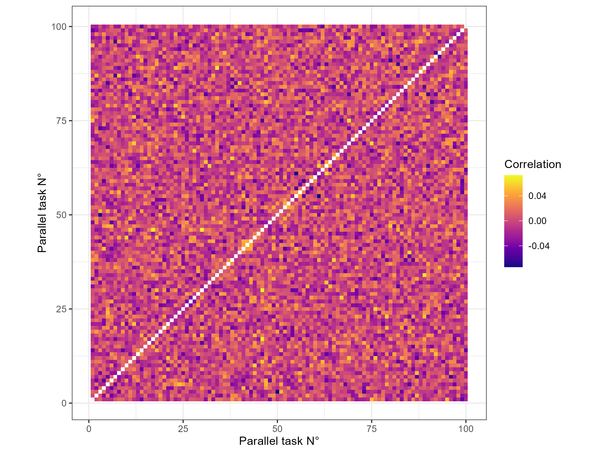
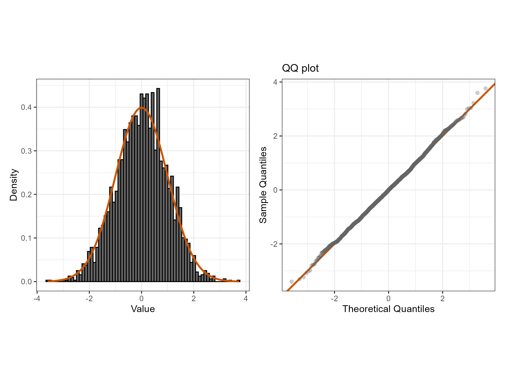
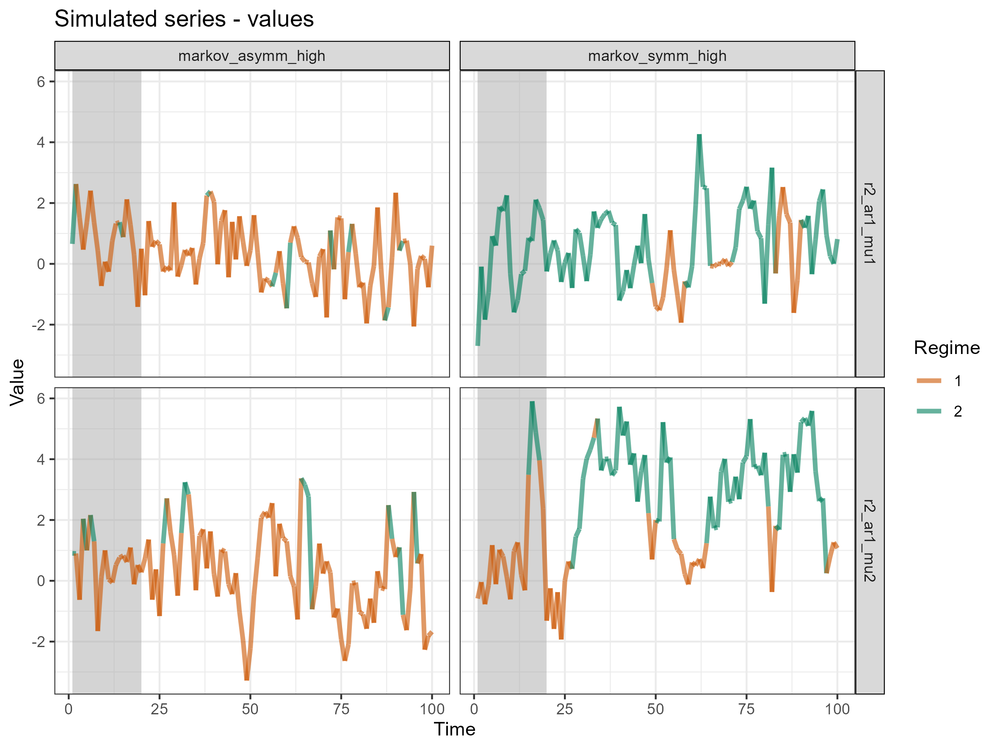
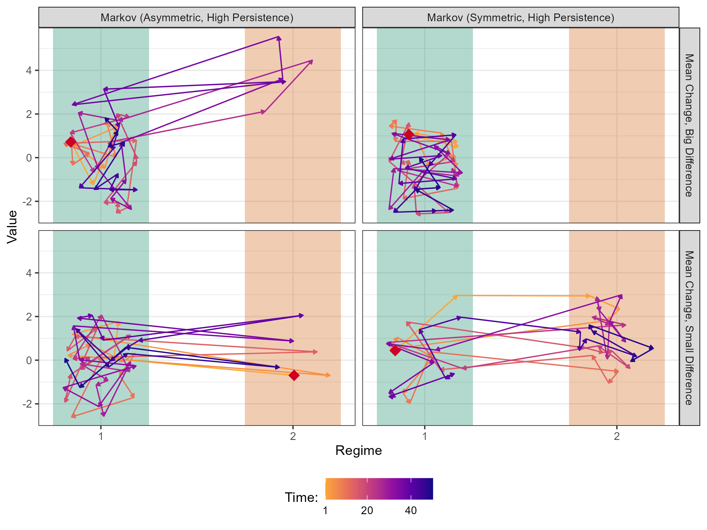
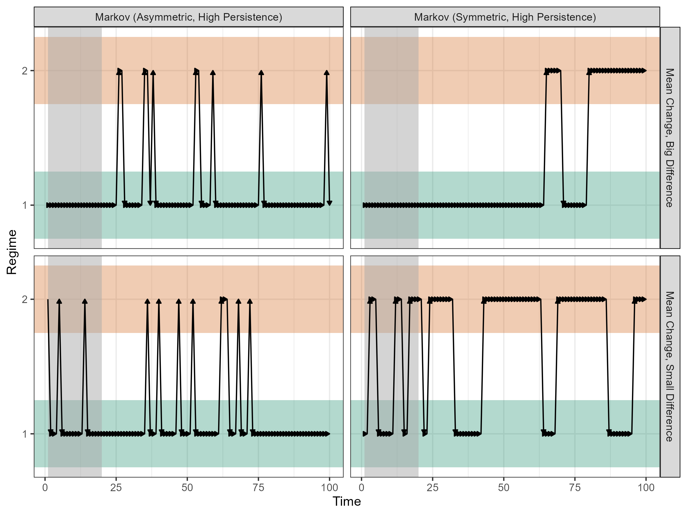
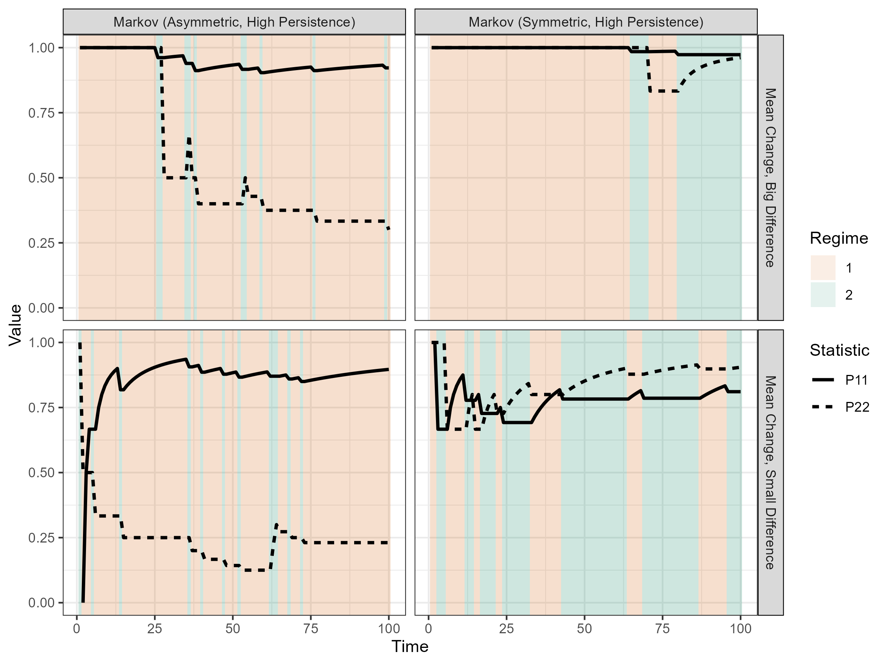
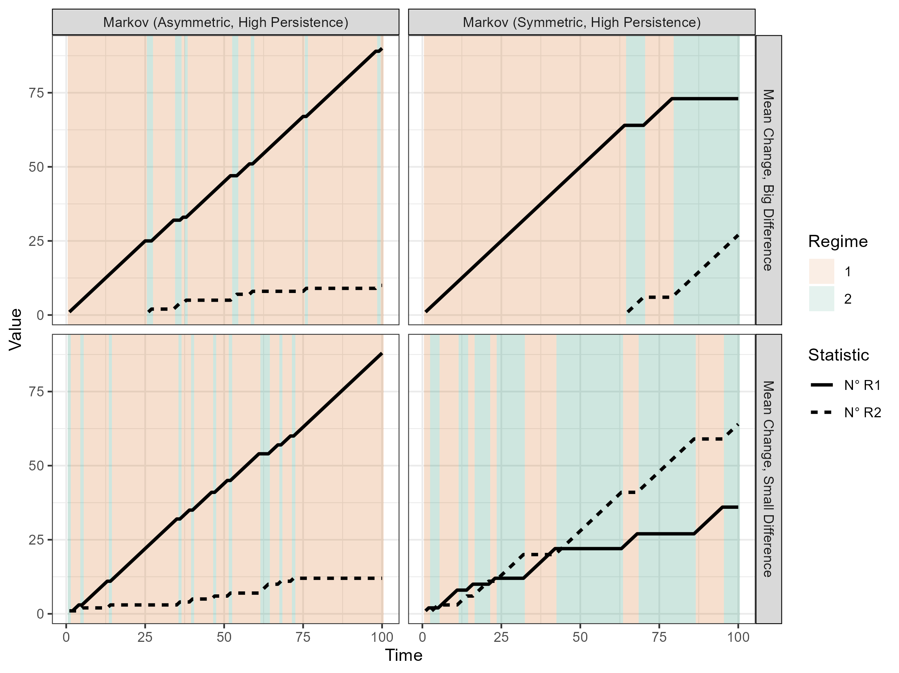
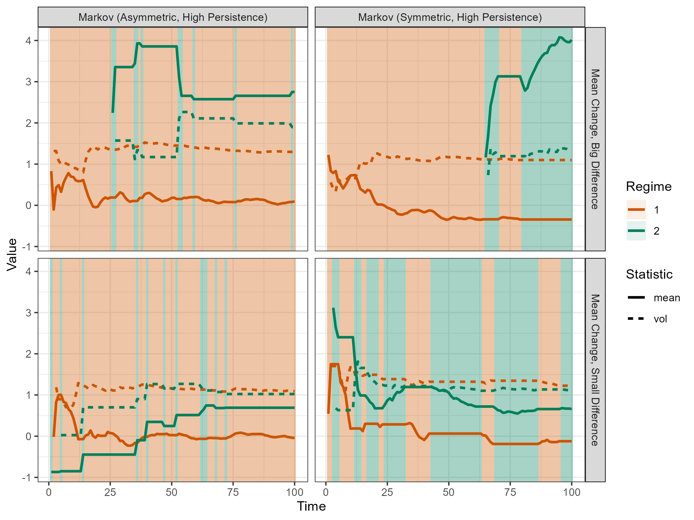

```{=tex}
\newcommand{\sgp}{\text{sgp}}
\newcommand{\rgp}{\text{rgp}}
\newcommand{\dgp}{\text{dgp}}
\renewcommand{\mod}{\text{mod}}

\renewenvironment{quote}
    {\list{}{\rightmargin\leftmargin}%
    \item\relax\color{red}}
    {\endlist}
```

> Esse documento já está em formato de artigo, ja tem algo de introdução e etc., mas é só um rascunho. Escrevi essas seções mais para guiar meu próprio raciocínio, sei que as coisas podem mudar bastante.

```{=tex}
\tableofcontents
```


# Introduction

> Esse primeiro texto é só uma motivação geral, já conversamos sobre.

Regime switching (RS) models describe time series that exhibit different behaviors across regimes -- for example, an $AR(1)$ process with one intercept before a structural break and another after it. These models have been widely used in economics and finance, for instance, to model business cycles and market volatility. There are several types of regime switching modeling, from stochastic switching, such as Markov-switching models, to deterministic switching, such as threshold models.

As with any forecasting model, it is important to understand the factors that relate to their performance, and how the econometrician can use this knowledge to improve their models.

RS models, by separating the data into different regimes, provide a rich environment to describe the data. One can calculate metrics that characterize each regime, or the degree of difference between them. These serve a dual purpose: they can be used to describe the DGP itself, in a more practical and meaningful way than the raw parameters; at the same time, they have meaning even when the DGP is unknown, and can be calculated based on estimated regimes.

While several papers have studied the performance of RS models in different economic contexts, I argue that the information provided by regime characteristics has been under-explored. If the characteristics of the regimes are related to the performance of the model, then the econometrician can use this information to better choose and understand their model.


## Questions of Interest

> Abaixo dei uma organizada nas várias perguntas interessantes, não todas precisam/darão para ser perseguidas. Acha que tem algo de mais ou de menos? Eventualmente seria importante definir as hipóteses que quero testar de maneira mais objetiva.

Some of these possible relationships are direct and expected. In the $AR(1)$ example above, it is expected that a RS model that yields regimes with different metrics on _conditional averages_ will perform better than one that does not, while a metric of _conditional volatility_ should not carry much meaning. In addition to listing and testing these expected relationships, there are further questions to be answered: which metric for a given characteristic can the models best match with the true one? Which is a better predictor of performance? How do these relationships change across different regime generating processes? For a given model, does the performance within a regime change with its characteristics?

In parallel, there are more specific questions: How does the effect of mis-specifying the number of regimes change with the degree of difference between regimes' characteristics? How does the ability to identify regimes' characteristics change with the sample size across regimes?

Finally, this setup is rich for understanding stylized facts about the differences between RS models across different contexts: In which cases does each perform better? Which is more sensitive to specific changes in the DGP? Is there a model that performs well in all contexts?

In general, the research question is: "What is the relationship between regimes' characteristics and forecasting performance, across different regime-switching models and DGPs?".


## Scope of the Exercises {#sec-scopes}

> Assim como acima, tentei definir todas as possibilidades. Conforme fomos avançando e vendo o que é mais interessante, limitamos o escopo. Por enquanto, o setup é igual pra todos.
>
> Gostou da maneira como dividi as possibilidades, nesta e na seção passada? Algo de mais ou de menos?

To answer the questions above, Monte Carlo simulations will be used. For different DGPs, several series will be simulated, and the considered RS models will be estimated for each. Then, the metrics are calculated, but in different fashions:

- For 'dataset' $A$, metrics are calculated for each regime.
    - Dataset $A1$ uses the true series, $A2$ uses the estimated series, and $A3$ uses the difference between the two, when applicable[^adiff].
    - The absolute value of the characteristic can be used, or its difference to the series average.
- For dataset $B$, the dispersion of metrics is calculated for each series.
    - The same sub-datasets $B1$, $B2$ and $B3$ are defined.

[^adiff]: When the DGP and model match in the number of regimes, and in the single parameter that varies. More on this at section @sec-metrics.

In addition to the regime characteristic, each dataset contains categorical data on the DGP and model used, as well as fit and forecast performance metrics. In general, $A2$ and $B2$ are known by the econometrician, so they will be the focus of this work.

Each question is answered with regression analysis, using a specific dataset, with a different variable of interest. The full explanation of each exercise is given in section @sec-exercises, but a summary is given below:

- The identification of characteristics comes directly from $A3$ and $B3$. These can be created with different sample sizes to measure its effect.
- Relationships between characteristics and performance can be analyzed at the series level with $B2$, and at the regime level with $A2$.
- A variable indicating mis-specification of the number of regimes can be added to the analysis.
- Stylized facts about the models come from analyzing interactions between DGP and model categories.

The rest of this work is divided as follows: @sec-literature shows the contribution of this paper, and what is already known about RS model performance; @sec-objects defines the objects of interest, such as the DGPs, models and metrics; @sec-simulations describes how the simulations were made and presents diagnostics; each exercise's methodology and result are presented separately in @sec-exercises; finally, @sec-conclusion concludes.


# Literature Review {#sec-literature}

> A lista abaixo é para referência futura, quando for escrever a revisão de literatura. Já pesquisei informalmente sobre o tema, mas ainda não sistematizei.
>
> Pode vir a ser uma subseção da introdução, ou uma seção separada, não sei ainda.
>
> No geral, é isso mesmo? Note que no momento da introdução dos modelos e métricas eu citarei os artigos originais.

Some of the claims that I intend to defend, in relation to the existing literature, are:

- There is demand for more studies on RS model performance. E.g. for model selection and prediction diagnosis.
- Little attention has been given to the relation between the characteristics of the regimes and the forecasting performance of the model.
- More could be learned about in which context each RS model performs better. Here what is already known will be listed, for comparison with my results.


# Objects of interest {#sec-objects}

## Context

> Não é o texto final, mas acharia válido iniciar com uns exemplos? Pensei que no mínimo para a apresentação seria útil.

Let's analyze two RS processes to familiarize ourselves, set some notation, and help define the general structure of RS DGPs.

### Example: SETAR {.unnumbered .unlisted}

Consider the self-exciting threshold autoregressive $\text{SETAR}$ model with two regimes below:

\begin{equation*}
    y_t = \begin{cases}
        \mu^1 + \phi^1_1 y_{t-1} + \varepsilon_t, & \text{if } y_{t-1} \leq \tau \\
        \mu^2 + \phi^2_1 y_{t-1} + \varepsilon_t, & \text{if } y_{t-1} > \tau
    \end{cases}
\end{equation*}

This is an AR process, but it has two different _regimes_. The regime is defined by whether $y_{t-1}$ exceeds the parameter $\tau$. In each regime $s$, the AR parameters $\phi^s_{.}$ are different, and thus so is the series' dynamics.

Note that the condition $y_{t-1} \leq \tau$ implies a region $y^1$ where it passes. Thus, we can rewrite the conditions as $\mathbb{1}(y_{t-1} \in y^1)$. The same can be done for $s = 2$. Additionally, let's define a _regime variable_ $r_t \in \{0, 1\}^2$, indexed by $r^s_t$. With that, we can write the model in summation form:

\begin{align*}
    r^s_t &= \mathbb{1}(y_{t-1} \in y^s), ~~ \forall s \in (1, 2)\\
    y_t &= \sum_{s=1}^2 \left( \mu^s + \phi^s_1 y_{t-1} + \varepsilon_t \right) \cdot r^s_t
\end{align*}

It is easy to generalize the model to $S \in \mathbb{N}$ regimes.


### Example: STAR {.unnumbered .unlisted}

The smooth transition autoregressive $\text{STAR}$ model comes from allowing a continuous function, in opposition to the indicator $\mathbb{1}$, to define the regimes. By choosing such a function $g$ as a CDF, the regime variable becomes a continuous weight for each regime:

\begin{align*}
    r^1_t &= g(y_{t-1}, \tau), ~~ r^2_t = 1 - g(y_{t-1}, \tau)\\
    y_t &= \left( \mu^1 + \phi^1_1 y_{t-1} + \varepsilon_t \right) \cdot r^1_t + \left( \mu^2 +\phi^2_1 y_{t-1} + \phi^2_2 y_{t-2} + \varepsilon_t \right) \cdot r^2_t
\end{align*}

Generalizing to $S$ regimes is not straightforward.

In the next section, I will define the general structure of RS DGPs. Additionally, I will present definitions for models and regime-dependent metrics. In the following section, I will list the specific DGPs, models, and metrics that will be considered in this work.


## Definitions

> Aqui o mais importante é a maneira como eu separei os 'ingredientes' do DGP, e a notação utilizada.

### DGPs

Let $y_t \in \mathbb{R}$ denote the series of interest at time $t \in 1:T$[^colon], $T \in \mathbb{N}$. In this work, I'll only consider univariate series. Let $r_t \in \mathbb{N}$ be the regime variable. Finally, let $S \in \mathbb{N}$ denote the number of regimes.

[^colon]: Let $a:b \coloneqq \{a, a+1, \dots, b\}$ for $a \leq b \in \mathbb{Z}$, and $y_{a:b} \coloneqq {y_t: t \in a:b}$.

A DGP can be written in terms of a pair: regime generating process (RGP) and series generating process (SGP). These are functions with parameters $\Theta_r$ and $\Theta_y$, respectively, such that:

\begin{equation}
\begin{array}{rrlllll}
    r_t &= \rgp(&y_{1:(t-1)}, &r_{t-1}, &t &;~ \Theta_r &)\\
    y_t &= \sgp(&y_{1:(t-1)}, &r_t,     &t &;~ \Theta_y &)\\
    y_t &= \sgp(&y_{1:(t-1)}, &\rgp(y_{1:(t-1)}, r_{t-1}, t; \Theta_r), &t &;~ \Theta_y &)
\end{array}
\end{equation}

Notably, the number of regimes $S$ is a parameter in $\Theta_r$, and $\Theta_y$ is actually a set of different parameters for each regime, each indexed by $\Theta^s_y$. This means that the SGP can be written as:

\begin{equation}
    \sgp(y_{1:(t-1)}, r_t, t;~ \Theta_y) = \sum_{s = 1}^S \sgp(y_{1:(t-1)}, t;~ \Theta^s_y) \cdot r^s_t
\end{equation}

Furthermore, $\Theta_y$ could encode different functional forms for each regime. As this is not common, I'll refer to $\sgp$ as the _SGP functional form_, or simply _SGP_, and the set of parameters $\Theta_y$ as the _regime nature_.

Figure 1 illustrates the structure of a general RS DGP.

\begin{figure}[H]
    \centering
    \caption{The general RS DGP structure.}

    \begin{tikzpicture}[font=\sffamily]
    % Styles:
    \tikzset{mybrace/.style={decorate, decoration={brace, amplitude=10pt, raise=1.3ex}}}
    \tikzset{node distance = 0.25cm and 0.1cm}

    % Main nodes:
    \node[] (dgp) {DGP};
    \node[] (e)   [right = 0.8cm of dgp] {$=$};
    \node[] (sgp) [right = 0.8cm of e] {SGP};
    \node[] (p)   [right = 1.4cm of sgp] {\&};
    \node[] (rgp) [right = 1.4cm of p] {RGP};

    % Lower nodes:
    \node[] (p2)   [below = 0.5cm of sgp] {\&};
    \node[] (csgp) [left  = of p2] {functional form};
    \node[] (rsch) [right = of p2] {regime nature};

    % Math:
    \node[] (msgp)  [above = of sgp] {$\sum_{s = 1}^S \sgp(. ~;~ \Theta_y^s) \cdot r_t^s$};
    \node[] (mrgp)  [above = of rgp] {$r_t = \rgp(. ~;~ \Theta_r)$};
    \node[] (mcsgp) [below = 0.35cm of csgp] {$\sgp$};
    \node[] (mrsch) [below = of rsch] {$\{\Theta^1_y, \dots, \Theta^s_y\}$};

    % Braces using the defined style, add mirror in place:
    \draw[mybrace]         (csgp.west) -- (rsch.east);
    \draw[mybrace, decoration={mirror}] (mrgp.west) -- (mrgp.east);
    \draw[mybrace, decoration={mirror}] (msgp.west) -- (msgp.east);
    \draw[mybrace, decoration={amplitude=8pt}]         (mcsgp.west) -- (mcsgp.east);
    \draw[mybrace]         (mrsch.west) -- (mrsch.east);
    \end{tikzpicture}
\end{figure}

To construct a diverse set of DGPs, I'll combine different RGPs, SGPs, and regime natures. One of the challenges of this work is to choose a comprehensible set of these elements, and analyze their differences in a systematic but manageable way.

In the notation above I omitted the error term. For our purposes, it is more useful to write the DGP as a function that receives a set of random error vectors[^erros], and returns the series and the regimes:

[^erros]: This is a simplification, assuming the same error distribution across regimes.

\begin{equation}
    (y_{1:T},~ r_{1:T}) = \dgp(\varepsilon_{1:T};~ \Theta_r, \Theta_y)
\end{equation}

Consider the notation shorthand $y \coloneqq y_{1:T}$, and similarly for other variables, used for the rest of this work.

> Comentário: Em relação a essa divisão do DGP, acha que está confuso? Em termos de notação inclusive.

Let the set of considered DGPs be $P$. These will be defined in @sec-sets.


### Models

Consider a model $\mod$ as a function with parameters $\Theta_m$ that generates the fitted values and $h$-step ahead predictions of the series and regimes:

\begin{equation}
    (\hat{y},~ \hat{r}) = \mod(y_{1:(T-h)},~ r_{1:(T-h)} ~;~ \Theta_m)
\end{equation}

Notably, the number of estimated regimes $\hat{S}$ is a parameter in $\Theta_m$, which may or may not be equal to $S$.

Let the set of models be $M$. These will be defined in @sec-sets.


### Metrics {#sec-metrics}

The metrics can be calculated in each of the fashions described in @sec-scopes, that is:

- Let $C^{A1}$ (for criteria) be the set of metrics calculated for each true regime, $C^{A2}$ for each estimated regime, and $C^{A3}$ for the difference between the two, when applicable, as will be described below.
- Let $C^{B1}$, $C^{B2}$ and $C^{B3}$ be the same, but for the dispersion of metrics across the series as a whole.

Metrics are functions. For A, they return a vector in $\mathbb{R}^S$ (or $\hat{S}$) of values; while for B they return a single value in $\mathbb{R}$. For the 1-variety, they receive the true values $y$ and $r$; for 2, the estimated values $\hat{y}$ and $\hat{r}$; and for 3, both the true and estimated values.

In all cases, the first step is to divide the serie $y$[^or_estimated] or into $S$ subsets $y^s$, each being a tuple containing all the contiguous instances of regime $s$. For each subset, the metric is calculated, often using the concatenation of all instances as its input. Disregarding the different contexts where each instance takes place is a simplification that only works for stationary processes.

[^or_estimated]: Or $\hat{y}$ for estimated-serie metrics, and similar for the other symbols in the following paragraphs.

Formally:

\begin{equation}
\begin{array}{rlll}
    \text{For $C^{A1}$:} &c: (y, r) &\mapsto (y^s)_{s = 1}^S &\mapsto \mathbb{R}^{S}\\
    \text{For $C^{A2}$:} &c: (\hat{y}, \hat{r}) &\mapsto (\hat{y}^s)_{s = 1}^{\hat{S}} &\mapsto \mathbb{R}^{\hat{S}}\\
    \text{For $C^{A3}$:} &c: (\hat{y}, \hat{r}, y, r) &\mapsto \left((\hat{y}^s)_{s = 1}^{\hat{S}},  (y^s)_{s = 1}^S\right) &\mapsto \mathbb{R}^{S}\\
    \text{For $C^{B1}$:} &c: (y, r) &\mapsto (y^s)_{s = 1}^S &\mapsto \mathbb{R}\\
    \text{For $C^{B2}$:} &c: (\hat{y}, \hat{r}) &\mapsto (\hat{y}^s)_{s = 1}^{\hat{S}} &\mapsto \mathbb{R}\\
    \text{For $C^{B3}$:} &c: (\hat{y}, \hat{r}, y, r) &\mapsto \left((\hat{y}^s)_{s = 1}^{\hat{S}},  (y^s)_{s = 1}^S\right) &\mapsto \mathbb{R}
\end{array}
\end{equation}

Dataset $A3$ can only be calculated when, across DGP and estimated model, the number of regimes match, and the same and only parameter varies. For example, for 2 regimes, with only the intercept changing, regimes in the true and estimated series can be identified by the same consistent way: the "regime with high intercept" and the "regime with low intercept". Any case where this matching does not happen is discarded for $A3$.

The sets of metrics will be defined in @sec-sets.

> Eu estou tentando usar definições que sejam gerais pros vários exercícios de interesse, mas não sei se acabou ficando confuso. Se focarmos em apenas um mais pra frente eu simplifico.
>
> No geral, não tenho visto muita utilidade em A1 e B1.


## Considered Objects {#sec-sets}

> Criei uma lista inicial, simples, sem necessariamente já ter pensado em todas as comparações que seriam interessantes de serem feitas, mas já com alguma inspiração. Especialmente, os valores das parametrizações não foram muito bem pensados ainda.
>
> Aqui citarei a literatura ao me referir aos modelos, talvez com mais informação no apêndice. Também comentarei o porque de cada escolha, qual comparação ela permite fazer, etc.
>
> Tem outros modelos mais complexos a se considerar, mas vamos começar obtendo os resultados pros mais simples.

### SGP Functional Forms

The functional form of the SGP could be important in its interaction with the other ingredients of the DGP. Additionally, some topics are interested in specific SGPs, such as conditional volatility in finance. For now, however, this does not seem to be the main point of interest. I will consider only an $AR(1)$ process, for its simplicity, popularity, and ease of estimation.

Furthermore, considering only stationary processes is useful, as non-stationarity brings problems for calculating metrics across a series. Even though many interesting DGPs are non-stationary, this simplification will be adopted. Thus, this restricts the parameters to $|\rho_1| < 1$.

**Stationary $AR(1)$ (AR):**

\begin{equation}
\begin{array}{ll}
    &y_t(. ~;~ (\mu, \rho_1, \sigma)) = \mu + \rho_1 y_{t-1} + \sigma \cdot \varepsilon_t, ~~ \varepsilon_t \sim \mathcal{N}(0, 1)\\
    &|\rho_1| < 1, ~~ \sigma > 0
\end{array} \tag{SGP-AR(1)}
\end{equation}


### RGPs

To start, I will consider only two regimes. Especially for the regime mis-specification exercise, this will need to be relaxed. I will consider the models Structural Break (SB), Self-Exciting Threshold (SET), Smooth-Transition (ST), and Markov-Switching (MS).


#### Structural Break (SB)

**Model:** Regime changes at specific time points $\tau \in \mathbb{N}^{S-1}$. Formally:

\begin{equation}
\begin{array}{ll}
    &r^s_t(. ~;~ \tau) = \mathbb{1}(\tau'_{s-1} < t \leq \tau'_s), ~~ \forall s \in \{1, \dots S\}\\
    &\tau \in \mathbb{N}^{S-1}, ~~ \tau_{s} > \tau_{s-1} ~\forall s, ~~ \tau' = (0, \tau, T)\\
\end{array}\tag{RGP-SB}
\end{equation}

**Considered parametrizations:**

- "Break at 1/2": A single structural break occurring at the midpoint of the series.
- "Break at 2/3": A single structural break occurring at two-thirds of the way through the series.


#### Self-Exciting Threshold (SET)

**Model:** Regime changes when the series, possibly at a lag $d \in \mathbb{N}^*$, crosses specific threshold values $\tau \in \mathbb{R}^{S-1}$. Transformations of the variable can be considered[^g_abs]. Formally:

[^g_abs]: For example, $g(x) = |x|$ which relates regimes with magnitude.

\begin{equation}
\begin{array}{ll}
    &r^s_t(. ~;~ (\tau, d, g)) = \mathbb{1}(\tau'_{s-1} < g(y_{t-d}) \leq \tau'_s), ~~ \forall s \in \{1, \dots S\}\\
    &\tau \in \mathbb{R}^{S-1}, ~~ \tau_{s} > \tau_{s-1} ~\forall s, ~~ \tau' = (-\infty, \tau, \infty), ~~ d \in \mathbb{N}^*
\end{array}\tag{RGP-SET}
\end{equation}

**Considered parametrizations:**

- "Threshold at 0": Switching occurs when the threshold variable crosses 0. Assuming $\mu = 0$.
- "Threshold at 0.5": Switching occurs when the threshold variable crosses 0.5.
- "Threshold (abs) at 0.5": Switching based on the absolute value of the threshold variable at 0.5.
- "Threshold (abs) at 2": Switching based on the absolute value of the threshold variable at 2.


#### Smooth Transition (ST)

**Model:** Regime changes smoothly, with a continuous function $g$, often a CDF, based on the difference between the series and the threshold $\tau \in \mathbb{R}$, possibly at a lag $d \in \mathbb{N}^*$. Generalizing to $S$ regimes is not straightforward, so consider only $S = 2$. Formally:

\begin{equation}
\begin{array}{ll}
    &r^1_t(. ~;~ (\tau, d, g)) = g(y_{t - d} - \tau), ~~~ r^2_t(. ~;~ (\tau, d, g)) = 1 - r^1_t(. ~;~ (\tau, d, g))\\
    &\tau \in \mathbb{R}, ~~ d \in \mathbb{N}^*
\end{array}\tag{RGP-ST}
\end{equation}

Often, the function $g$ depends on a smoothness parameter $\gamma$, i.e., when $\gamma \to \infty$, $g \to \mathbb{1}$. This parameter can be jointly estimated with the others.

**Considered parametrizations:**

- "LSTAR at 0": Smooth transition between regimes using a logistic CDF centered at 0.
- "LSTAR at 0.5": Smooth transition using a logistic CDF centered at 0.5.
- "ESTAR at 0": Smooth transition using an exponential CDF centered at 0.
- "ESTAR at 0.5": Smooth transition using an exponential CDF centered at 0.5.


#### Markov-Switching (MS)

**Model:** Regime changes stochastically, following a Markov process with transition matrix $\Gamma \in [0, 1]^{S \times S}$. The probability of being in regime $s$ at time $t$ depends only on the regime at time $t-1$, often with $\Gamma$ implying some persistence. Formally:

\begin{equation}
\begin{array}{ll}
    &r^s_t(. ~;~ \Gamma) \sim P(r^s_t = 1 | r_{t-1}) \eqqcolon \Gamma_{s, r_{t-1}}\\
    &\Gamma \in [0, 1]^{S \times S}, ~~ \sum_{i=1}^S \Gamma_{s, i} = 1 ~\forall s\\
\end{array}\tag{RGP-MS}
\end{equation}

**Considered parametrizations:**

- "Multinomial Equal": Simple multinomial process, independent of the past, with equal probabilities for all regimes.
- "Multinomial Regime 1": Multinomial process but with a probability skewed towards regime 1.
- "Markov Symmetric, High Persistence": High persistence ($0.9$).
- "Markov Symmetric, Low Persistence": Low persistence ($0.6$).
- "Markov Asymmetric, High Persistence": Different but overall high probabilities of staying in each regime ($0.9$ for regime 1, $0.7$ for regime 2).
- "Markov Asymmetric, Low Persistence": Different but overall low ($0.8$ for regime 1, $0.6$ for regime 2).

> Comentário: escolhi várias opções por completude. Acho que vale a pena pensar se todas são realmente interessantes. Os valores dos parâmetros estão meio aleatórios por enquanto.
>
> Não sei se vale a pena considerar LSTAR e ESTAR. Talvez valha a pena considerar alguma transformação assimétrica no threshold também.


### Models

> Ainda vou descrever com mais precisão o processo de estimação de cada modelo, e o que isso pode implicar para a minha análise.

All the RGPs above have model counterparts, and I will use all of them. An additional clustering-based model will also be considered. The hyperparameterization will be mostly fixed, as the most interesting comparisons are between the different models, not between different hyperparameterizations of the same model.

Below, I describe the estimation process and hyperparameterization for each model. All of them assume two regimes. Each assumes the structure of the RGP with the same name.

#### Structural Break AR (SBAR)

**Model:** Given $\tau$, the model estimates $\mu$ and $\rho_1$ via OLS in each regime. $\tau$ is chosen by minimizing the sum of squared residuals over a grid search of breakpoints.

**Considered parametrizations:** No hyperparameterization needed.

#### Self-Exciting Threshold AR (SETAR)

**Model:** Given $\tau$ and $d$, the model estimates $\mu$ and $\rho_1$ via OLS in each regime. $\tau$ and $d$ are chosen by minimizing the sum of squared residuals over a grid search of breakpoints and lags. One can also leave $d$ fixed.

**Considered parametrizations:** The same transformation function $g$ as in the RGP will be considered. $d$ will be fixed at 1.


#### Smooth Transition AR (STAR)

**Model:** Estimated via non-linear squares of the residuals, over $\mu$, $\rho_1$ (for each regime), $\tau$, and $\gamma$. Uses some numerical optimization, which depends on starting values, and does not guarantee a global optimum.

**Considered parametrizations:** The same transformation function $g$ as in the RGP will be considered. Gamma will be fixed at a smaller-than-standard smoothness, $1.5$.


#### Markov-Switching AR (MSAR)

**Model:** The MSAR DGP can be written in terms of a state-space model, which can then be related to filtering and smoothing techniques. The EM algorithm uses Kalman to find smoothed probabilities of $r$, then the conditional probabilities given the current guess of parameters, then the guess of parameters is updated via maximizing the likelihood given the probabilities. These two steps are iterated until convergence.

**Considered parametrizations:** No hyperparameterization needed.

#### Clustering AR (CAR)

**Model:** Unsupervised clustering techniques, such as K-Means, can be used to estimate the regimes based on $y_t$, its lags, and transformations. Given the regimes, $\mu$ and $\rho_1$ are estimated via OLS. This hybrid approach yields non-standard asymptotic properties.

**Considered parametrizations:** Basic K-Means will be used.


### Regime Natures

The following regime natures are considered, each representing a different way in which the SGP parameters change across regimes. Each item is in the format (_parameter in regime 1_, _parameter in regime 2_):

- **Mean ($\mu$) change:**
    - Small difference: ($\mu = 0$, $\mu = 0.5$)
    - Large difference: ($\mu = 0$, $\mu = 2$)
- **Persistence ($\rho_1$) change:**
    - Small difference: ($\rho_1 = 0.6$, $\rho_1 = 0.4$)
    - Large difference: ($\rho_1 = 0.9$, $\rho_1 = 0.1$)
- **Sign Switching ($\rho_1$):**
    - Small difference: ($\rho_1 = 0.3$, $\rho_1 = -0.3$)
    - Large difference: ($\rho_1 = 0.7$, $\rho_1 = -0.7$)
- **New Lag ($\rho_2$) introduction:**
    - Positive, small: ($\rho_2 = 0$, $\rho_2 = 0.2$)
    - Positive, large: ($\rho_2 = 0$, $\rho_2 = 0.5$)
    - Negative, small: ($\rho_2 = 0$, $\rho_2 = -0.2$)
    - Negative, large: ($\rho_2 = 0$, $\rho_2 = -0.5$)
- **Volatility ($\sigma$) change:**
    - Small difference: ($\sigma = 1$, $\sigma = 2$)
    - Large difference: ($\sigma = 1$, $\sigma = 4$)

> Comentário: pode ter umas opções que não são muito observadas na realidade, e podem ser removidas, como a mudança de sinal. Achei que a ideia de um regime que adiciona um lag adicional $\rho_2$ interessante, para poder considerar SGP além do $AR(1)$, mas não sei se faz sentido.

In general, the large vs. small differences will be interesting to analyze in relation to each other. To compare different types of changes, only the large or small differences will be considered, for simplicity.


### Metrics

> Essa seção é bem importante, e acho que é onde há espaço pra um input mais original. Ao mesmo tempo, tem que pensar direito. No momento são algumas ideias iniciais. Creio que conforme fomos obtendo resultados dos exercícios de para pensar melhor nisto.

Each change specified by the regime natures is expected to affect the series in a different way, and thus, be captured by different metrics. In this section, I'll list the 'types' of changes for each regime nature, and then the metrics that I'll consider for that type.

The first choice is obvious, the parameter of interest. One might think that this would outshine all other metrics, but in more complex cases where more than one parameter changes, this becomes less useful. The benefit of the metrics is in their abstraction over the DGP.

Secondly, there is usually a metric that very directly targets the change, such as conditional average for changes in intercept.

Some types of changes condition more specific metrics, and finally, there are more general metrics that can be used in all cases, often ones that relate to the RGP, such as average duration of a regime.

When talking about dispersion, one often only needs to calculate the dispersion of the metrics themselves, across regimes. For example, the standard deviation of the conditional means, or average pairwise distance between conditional means. Additionally, this dispersion measure can be further investigated via the SD and minimum of the pairwise distances.

#### Fronteir Weights

Lastly, note that, in contrast to the usual clustering context, with time series, where the 'clusters' (regimes) have a temporal structure, not all points are equally relevant. Considering the SB model, the distance between $y_1$ and $y_T$ does not inform about the regime separation; it is obvious that they are in different regimes. The most relevant points are the ones close to the breakpoints.

The above is as true as the persistence of the regimes is strong. Thus, we can calculate metrics using weights inversely proportional to the distance to the nearest breakpoint. Let $\text{breaks}$ denote the set of breakpoints' $t$s, and $X$ denote the set of $t$s within a specific instance of a specific regime. Consider the examples below:

\begin{align*}
    &d(t, \text{breaks}) = \min_{t_b \in \text{breaks}} |t - t_b|\\
    &~\\
    &w(X; k) = \{\mathbb{1}(d(x, \text{breaks}) \leq k),~ x \in X\}\\
    &w(X; k) = \left\{\frac{d(x, \text{breaks})}{\sum_{x' \in X} d(x', \text{breaks})},~ x \in X\right\}
\end{align*}

Furthermore, for a given regime, I can calculate $S - 1$ versions of the metric, each considering only the breaks between that regime and one of the others. These are useful to compare a more specific pairwise difference.

For all of the metrics below, the weighted version will also be calculated.

> O que achou dessa ideia?


#### Mean ($\mu$) change

The first option is the **estimated parameter**, $\widehat{\mu^s}$. Secondly, the **conditional mean**. Medians are often used to deal with outliers, but in this controlled environment this is not needed. On top of both, the four dispersion measures are calculated.

The intercept change is interesting because all of its effect is individually included in the level of each observation. Thus, we can also consider point-wise distances between regimes. That is, instead of comparing conditional means, we can compare pointwise distances. Both intra-cluster and inter-cluster distances can be calculated using averages or min/max, and the two can be combined into different relative measures of dispersion. This implies many options, so I'll use two principles to choose the most interesting ones: the min distance is mainly useful at the regime level, i.e., to identify the 'neighboring regime'[^neighbors]; the centroid distance is basically a simplification of the average of pairwise distances.

[^neighbors]: This idea is especially meaningful when there is only one parameter changing, and thus the regimes can be ordered.

With the above in mind, the most interesting option remaining is the **silhouette score**: the difference between the intra-cluster distance from point $a$ and the nearest inter-cluster distance, divided by the maximum of the two. Additionally, the **average of all pairwise distances** can be calculated using the frontier weights.

These measures could be calculated using other distances than the Euclidean one, but I won't consider that for now.

#### Persistence ($\rho_1$) change

The first option is the **estimated parameter**, $\widehat{\rho_1^s}$. Secondly, the **conditional autocorrelation** of lag 1, $\text{ACF}(y_t | y_t \in y^s, 1)$. On top of both, the four dispersion measures are calculated.


#### Sign Switching ($\rho_1$)

The first option is the **sign of the estimated parameter**, $sign(\widehat{\rho_1^s})$. Secondly, the conditional proportion of sign changes: $P(sign(y_t) \neq sign(y_{t-1}) | y_t \in y^s)$. On top of both, the four dispersion measures are calculated.


#### New Lag ($\rho_2$) introduction

As I am considering only $AR(1)$ models, there won't be a direct parameter for this. One option would be to check if this additional lag is captured by a **higher $\rho_1$**, another would be to look for **PACF(2) of the residuals**. Secondly the **conditional partial-autocorrelation** of lag 2, $\text{PACF}(y_t | y_t \in y^s, 2)$. On top of both, the four dispersion measures are calculated.


#### Volatility ($\sigma$) change

The first option is the **estimated parameter**, $\widehat{\sigma^s}$. Secondly, the **conditional standard deviation**, $\text{SD}(y_t | y_t \in y^s)$. On top of both, the four dispersion measures are calculated.


#### Performance and Other Metrics {.unlisted}

The performance metrics considered are $R^2$ for fit performance, and $RMSE$ for forecasting performance. For robustness, I'll see if the results change when using $MAPE$ for both.

Some other metrics don't fit in the categories above, but are interesting to consider. Mainly, the average duration and number of instances of a regime, and transition probabilities.

On the more general side, one can estimate the distribution of $y^s$, and use distribution distance metrics to compare to the other regimes, such as the Earth Mover's Distance.


## Considered Parameters

Here I'll quickly list the considered parameters for the simulations. For now:

```r
n_s <- 30L # Number of simulations
n_t <- 100L # Number of time periods
n_burn <- 20L # Burn-in periods
n_h <- 1L # Number of periods to predict
```

> Valores aleatórios que estou usando agora pra testar. Depois descrevo os valores 'reais' e a lógica por trás deles.


# Simulations {#sec-simulations}

> Também já conversamos sobre isso.

There are the following steps to perform the simulations:

1. Generate random errors given the DGP.
2. For each DGP and simulation, generate ($y, r$).
3. For each model, DGP, and simulation, obtain $(\hat{y},~ \hat{r})$.
4. For each model, DGP, and simulation, compute each metric.
5. Aggregate the metrics, performance information, and DGP and model descriptors into datasets.

<!-- The order and nesting used to organize the steps can be changed to optimize performance (e.g., via parallelization) and/or modularity. Below, I describe the chosen algorithm. Its implementation is done in the R language., and the code can be found in [this paper's repository](https://github.com/ricardo-semiao/article-regime-id-performance). -->

Let $i \in 1:I$, $I \in \mathbb{N}$ be the simulation index.


## Simulating Series

I assume that all DGPs have the same error distribution -- but note that a DGP can have a volatility parameter multiplying its error. Thus we need to create $I$ sets of random error vectors, each of size $1:T$. The nesting order does not matter, and the errors were generated for each pair $(dgp, s)$, in parallel, using [TRNG](https://www.numbercrunch.de/trng/). Let $\Epsilon$ denote the set of all errors.

For each $p \in 1:|P|$ and $i \in 1:I$, let $\Epsilon_{p, s}$ denote the vector of errors generated for the $p$-th DGP and the $s$-th simulation. Similar indexing definitions will be used for similar collections throughout this document.

Let $Y$ and $R$ denote the sets of generated series and regime variables. For each $p$ and $s$, their elements are denoted via the index notation $Y_{p, s}$ and $R_{p, s}$. They are computed given $\Epsilon_{p, s}$:

\begin{algorithm}[H]
\begin{algorithmic}[1]
    \State Initialize $Y$ and $R$
    \For{$p$ \textbf{in} $1:|P|$}
        \State Spawn a new parallel task
        \State $\dgp \gets P_p$
        \For{$i = 1$ \textbf{to} $I$}
            \State $Y_{p, i},~ R_{p, i} \gets \dgp(\Epsilon_{p, i})$
    \EndFor
\EndFor
\end{algorithmic}
\end{algorithm}


## Estimating Models and Metrics

Now, for each simulation, we estimate each model, generating the sets $\hat{Y}$ and $\hat{R}$. The nesting order is the same as above, for consistency, but with an additional inner loop for the models.

\begin{algorithm}[H]
\begin{algorithmic}[1]
    \State Initialize $\hat{Y}$ and $\hat{R}$
    \For{$p$ \textbf{in} $1:|P|$}
        \State Spawn a new parallel task
        \For{$i$ \textbf{in} $1:I$}
            \For{$m$ \textbf{in} $1:|M|$}
            \State $\mod \gets M_m$
                \State $\hat{Y}_{p, i, m},~ \hat{R}_{p, i, m} \gets \mod(Y_{p, i},~ R_{p, i})$
            \EndFor
        \EndFor
    \EndFor
\end{algorithmic}
\end{algorithm}

For the metrics, recall that each set creates a different dataset, as they receive different inputs and return different output sizes. Let $D^{A1}$ denote the dataset for $C^{A1}$, and similarly for the other sets.

For simplicity, consider $C^{A1}(y, r)$ as mapping each metric's result into a $S \times |C^{A1}|$ matrix, or $1 \times |C^{B1}|$. Consider similar definitions for the other sets. Formally:

\begin{equation*}
    C^{A1}(y, r) \coloneqq \begin{bmatrix}
        C^{A1}_1(y, r) &
        C^{A1}_2(y, r) &
        \dots
    \end{bmatrix}
\end{equation*}

Then, the calculation of all metrics is done as follows:

\begin{algorithm}[H]
\begin{algorithmic}[1]
    \State Initialize all $D$'s
    \For{$(p, i)$ \textbf{in} $(1:|P|) \times (1:I)$}
        \State $D^{A1}_{p, i, 1:S} \gets C^{A1}(Y_{p,i}, R_{p,i})$
        \State $\mathllap{D^{B1}_{p, i}}\hphantom{D^{A1}_{p, i, 1:S}} \gets C^{B1}(Y_{p,i}, R_{p,i})$
        \For{$m$ \textbf{in} $1:|M|$}
            \State $D^{A2}_{p, i, m, 1:S} \gets C^{A2}(\hat{Y}_{p, i, m}, \hat{R}_{p, i, m})$
            \State $\mathllap{D^{B2}_{p, i, m}}\hphantom{D^{A2}_{p, i, m, 1:S}} \gets C^{B2}(\hat{Y}_{p, i, m}, \hat{R}_{p, i, m})$
            \State $\mathllap{D^{A3}_{p, i, m, 1:S}}\hphantom{D^{A2}_{p, i, m, 1:S}} \gets C^{A3}(\hat{Y}_{p, i, m}, \hat{R}_{p, i, m}, Y_{p, i}, R_{p, i})$
            \State $\mathllap{D^{B3}_{p, i, m}}\hphantom{D^{A2}_{p, i, m, 1:S}} \gets C^{B3}(\hat{Y}_{p, i, m}, \hat{R}_{p, i, m}, Y_{p, i}, R_{p, i})$
            \State all $D$'s $\gets$ performance metrics and DGP/model categorical descriptors
        \EndFor
    \EndFor
\end{algorithmic}
\end{algorithm}

Note that the datasets are sets of columns, each being a metric, performance measure, or categorical descriptor. Each dataset has a different granularity:

- $D^{A1}$: variables for each $p, i, s$.
- $D^{B1}$: metrics for each $p, i$.
- $D^{A2}$ and $D^{A3}$: metrics for each $p, i, m, s$.
- $D^{B2}$ and $D^{B3}$: metrics for each $p, i, m$.

> Talvez tenha ficado confuso. Queria ao final descrever como os resultados estão agregados num formato tabular, primeiro porque é como eu faço no código, segundo porque é fácil de visualizar as regressões depois. Mas não sei se notações como mapear $C^{A1}$ e indexar $D^{A2}_{p, i, m, 1:S}$ ficaram confusas.


## Simulation Diagnostics

> Depois discutimos o que acha dos diagnósticos que fiz, se falta alguma coisa, se algum desses é desnecessário, etc. Muito disso pode ir para um apêndice. Falta interpretar mais e apresentar os resultados de todos os DGPs, especialmente evidência não apenas visual.

It is important to check if the simulations were performed correctly and that each series presents the expected property.


### Errors Diagnostics

The errors should be i.i.d. normal, and should not present any pattern, especially across the parallelization structure. This is guaranteed by the TRNG library, but it doesn't hurt to check.

The @fig-diag-errors-dependence shows the correlation of the errors across the parallelization structure. A simple visual check shows no evident patterns, and an overall low correlation, as expected.

{#fig-diag-errors-dependence height=45%}

The @fig-diag-errors-distribution shows the distribution of a size 3000 sample of the errors, via the usual histogram and QQ-plot. The distribution is very close to normal, as expected.

{#fig-diag-errors-distribution height=45%}


### Series Diagnostics

The first step is to plot some series, to visually check if they look as expected. We can plot várias DGPs para analisá-las em relação às outras. Analyzing all the plots is out of the scope of this document, but the full simulations are present in the repository, and the appendix contains the numeric diagnostics for all DGPs.

The @fig-diag-series-one shows a single simulation for the MS DGPs (columns) and the $\mu$ regime natures (rows). Between columns, we can indeed see that the left has a higher prevalence of regime 1, while the right is more balanced. Between rows, we can see how the level of the series changes more drastically in the bottom one. The grey area is the burn-in period.

This could have been by chance, so in @fig-diag-series-mult I present 7 random, overlapping, simulations. While harder to read, we can still see the same patterns.

{#fig-diag-series-one height=45%}

{#fig-diag-series-mult height=45%}

A different way to analyze basically the same information is @fig-diag-series-paths, a traceplot of $r \times y$, which shows the 'path' of the joint distribution of $y$ and $r$. Jitter was added to $r$ for visualization purposes.

{#fig-diag-series-paths height=45%}

Finally, we can focus attention on the regimes themselves. The @fig-diag-regimes shows the path of regimes across time.

{#fig-diag-regimes height=45%}


### Metrics Diagnostics

On top of the general structure of the series, we can analyze specific metrics. This is useful as it is more systematic, and can be presented as a table for all DGPs, to complement the graphs. To also get information about convergence, we can compute the 'rolling' metrics with fixed initial point at $t = 1$.

> Essa noção de convergência é para uma dada simulação, convergência no tempo. Também deveria pensar em convergência ao longo de $I$, e/ou ao longo de $T \times I$.

For the regimes, some options are the average duration of a regime, the number of observations of a regime, and the transition probabilities (for $S = 2$). View these in @fig-diag-stat-transmat and @fig-diag-stat-nobs. We can see, for example, the assymetry on the first column.

{#fig-diag-stat-transmat height=45%}

{#fig-diag-stat-nobs height=45%}

For the series, in this case of $\mu$ changing, we can compute the conditional mean, and standard deviation (as a placebo test). The results are in @fig-diag-stat-mean, and indeed show differences in mean, bigger in the bottom row, and no real differences in volatility.

{#fig-diag-stat-mean height=45%}

> Ainda não fiz a versão tabela para todos os DGPs.


# Exercises {#sec-exercises}

> Novamente, nem todos serão necessariamente perseguidos. Agora com os objetos mais bem definidos, os exs ficam um pouco mais concretos.
>
> Dito isso, ainda não dei atenção à essa seção. O meu objetivo é escrever exatamente quais regressões seriam feitas, quais os coeficientes de interesse, e como seriam interpretados. Similar com o que comentei na introdução sobre criar uma lista de hipóteses. Porém, vou seguir trabalhando no código, e revisar as ideias depois de ter uma perspectiva melhor do que é possível de ser feito.

As there is a lot of variety in the models and DGPs, a smart way to visualize the results is needed. One possible option is discussed here. For a given metric, one annotates its effect in a matrix, varying the DGP in the rows and model in the columns. This can then be visualized as a heatmap.

> Depois pensarei melhor sobre isso, e considerarei alternativas.


## Stylized Facts about Models

I will run regressions with fixed effects for DGP and model, separate the model effects into RGP, SGP, and regime nature effects, and analyze these effects. Also, I will study the sensitivity to mis-specification, via an indicator variable $\mathbb{1}(p = m)$ or with a full interaction $m \times p$.


## Regime Characteristics Identification

Using $A3$ and $B3$, analyze how well each model can identify the true regime characteristics. RGPs that generate asymmetry should harm the identification of the model, and require a larger overall sample size. I will only consider varying the sample size $T$ if time permits.


## Performance And Regime Dispersion

Theoretically, for each regime nature, i.e., each type of change across regimes, which regime characteristics should be relevant? I will list these theoretical relations, and then analyze if they are empirically verified.

How do these results change with the RGP?


## Performance And Regime Characteristics

For a given model, does the performance within-regime change with its characteristics? Regressions using $A2$.


## Mis-specification of the Number of Regimes

Considering only simulations where $\hat{S} \neq S$, I will create an indicator variable for $\hat{S} < S$, and check for interactions between it and regime characteristics, mainly with $B3$. The idea is that if the dispersion across regimes is low, mis-specifying the number of regimes should not be as harmful.


## Empirical Application {#sec-application}

If there is time, test if the practical recommendations help in a real world example, and if the patterns found in the simulations are observed in real data.


# Conclusion {#sec-conclusion}

Here I'll start by summarizing the motivation and methodology.

Then, focus on the main results. First, with the more descriptive findings about properties of the models, then, the practical recommendations of metrics an econometrician should look at when choosing a model.

> Algum outro comentário geral sobre o trabalho? A organização das seções está boa? Etc.
